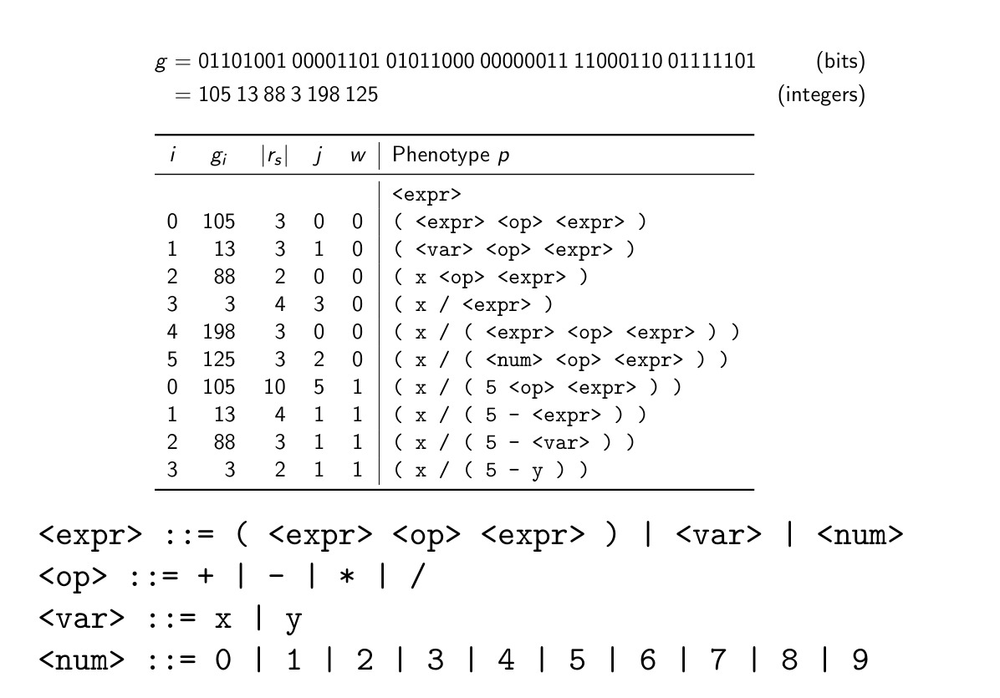
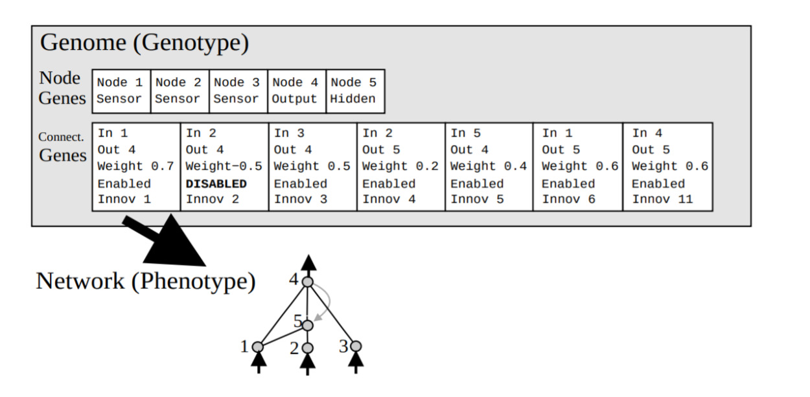

# Evolutionary Computation


## The concept of Evolution


### A general introduction

What is *Evolutionary Robotics*?

It's the application of techniques known as *evolutionary computation* into *robotics*. The most intersting part of evolutionary robotics is not industrial robots, but a specific kind of robots that show great independentness. Such robots are basically able to adapt to not-fully-known environments.

In general, robots are *agents* with a physical body. An *agent* is any entity capable of performing actions with any impact.

In this course we will apply evolutionary computation techniques to assess robotics problem. We will first see some evolutionary computation techniques, and then we will survey a few examples of applications of those techniques to evolutionary robotics. The last part is a summary of those robotics techniques, along with presentation reasoning.


### Definition of Evolutionary Computation

There is an universe of possible (the *source* space), and a *measure of quality* of those things. Optimization means find the *best possible item* in this universe, according to the definition of the quality.

The real goal is to build a good optimization system.

There is one interesting scheme for solving any possible optimization problem, that also happens in nature, this is called **evolution**. Evolution is what made us humans, so there's nothing more of a proof than saying that we're alive (and hopefully doing well) because of it. Evolution itself can be summarized by the following characteristics

-   the *universe of possible* is given by laws of physics;
-   the *quality* is the ability of being alive;
-   the *solver* is nature itself - nature was pretty successful in taking creatures alive;
-   the *natural evolution* is the optimization algorithm employed by nature to solve the problem.

From this core idea, *evolutionary computation* takes place. The field of EC is the one that tries to reproduce *natural evolution on machine*, in order to be able to solve *every possible optimization problem*.


### The four principles of Evolution

A general and basis scheme is comprised of the following hypothesis.

1.  The first one, is that there is *a population of individuals that compete for limited resources*.
2.  The population is *dynamic*: individuals should die and be generated.
3.  A third key principle is that *fittest individual should survive and reproduce more than the other individuals*.
4.  Last, *offspring inherit some characteristics from parents* - they're *similar*, not identical. This is the most subtle of the four principles.

If offsprings are completely different from parents, there's no point in accumulate good characteristics through evolution. If offsprings are identical to parents, there's no evolution since no progress will be made.


### A brief history

-   1930: first ideas
-   1960: development of ideas using first computers
-   1970: exploration of ideas
-   1980: exploitation of ideas
-   1990: unification of ideas
-   2000+: mature expansion of ideas

Basically, there are 3 communities involved in EC,

1.  *computer scientists*: they saw EC as a good opportunity to *solve problems when it is the only tool available*. They wanted to build interesting artifacts and programs automatically;
2.  *biologists*: they desire to *study and understand real evolution*;
3.  *artificial-life researchers*: their goal was, instead, to *build and study artificial worlds* (for instance, machine behaviors studies, machines as living things).

Result of this fragmentation was some *duplications*, *different vocabularies*, *strong habits*. Unification and removal of this inconsistencies happened in the 90s.


## Realizing Evolution on machines

First, there are some important things to assess and define to realize evolution on machines.


### Individual

An *individual* is a *candidate solution*. This is seen from the optimization point of view. Thus, it may be:

-   a *program* in a given programming language;
-   a *set of numerical parameters* (a tuple of parameters);
-   a *picture*;
-   $\dots$

The above is commonly called *external representation*, and it's in contrast with the *internal representation*. Internal representation is how we internally represent an invididual. It depends on what the individual is. It may be, for instance,

-   *itself*: this is good if individuals are programs, sets, pictures;
-   a well-defined *data structure*: this is particularly good representation when we can describe it with numbers.

External appearance of an individual is called *phenotype* $P$. Internal representation is, instead, called *genotype* $G$. Thus, the phenotype will correspond to the external representation of an individual, while the genotype (the DNA) will correspond to the internal representation. The phenotype is our *solution*.

Basically, genotypes and phenotypes are, respectively, the way in which our individual is **internally represented** in our evolutionary computation system and the way in which this internal represention **is manifested** externally.

This kind of dual representation is employed for two reasons. To begin with, our choice will resemble what nature already does. We are taking inspiration from nature.

Secondly, manipulating $G$ and $P$ is much easier this way. In fact, when we reproduce existing individuals we will manipulate $G$: in genotype space we can use again existing techniques, provided we defined genotype generally enough.

The function that transforms a genotype to phenotype is called *genotype-phenotype mapping function*. That function is usually denoted with $\phi$.

The representation of an invididual is, therefore, determined by the following set,

$$ \{G, P, G \rightarrow P\}.$$

Usually, $P$ is not strictly required. One could obtain $P$ by $G$ applying the genotype-phenotype mapping function $\phi$, such as $\phi: G \rightarrow P$.


### Population

A *population* is a *flat* collection of individuals with a (very often) fixed max size. Flat means there are no internal structures, no relationships between individuals, no ordering. With term *collection* we say that there may be two ore more individuals equal to each other.

The concept of *limited resources* is related to the *right to be in the population*. The scarse resourse is, therefore, the fixed max size of the population for which any individual strives to be in.

At each discrete quantum of time $t$, we have a new population. The population is *dynamic* when a new individual is born and some individuals must leave the population (they die). The rule for removing/modifying population is called *replacement strategy* (also called *generational model*). This is, in a way, the \`\`algorithm'' according to which individuals are born and die, realizing the dinamicity of the population by means of this mechanism.

There are some assumptions to do:

-   individuals life is *instantaneous*. Given the genotype, the phenotype and the fitness are immediately known. This is not true in nature, as individuals life is far from istantaneous. This isn't true in robotics either: fitness is basically related to a robot's behavior, which must be evaluated;
-   time flowing is only determined by *births* and *deaths*. Each $t$ is called **generation**. Generation term could also be referred to the population living in a specific time $t$.


### Generational model

The *generational model* is the procedure with which we realize the dynamicity of a population. Also called *replacement strategy*, in a way it is the model that we employ in order to evolve our population by creating new generations each time $t$.

There are some parameters. In particular, the most common parameters set is:

-   $m$ *parents*;
-   $n$ *offsprings*;
-   a *boolean flag*, which is `overlapping` or `non-overlapping`. If `overlapping == True` we merge both parents and offsprings. If it is `False`, all parents die while only offsprings are born


#### Overlapping generational model

Overlapping models will see $n$ offsprings built from $m$ parents. Population of $n + m$ individuals is obtained by such merge. Only some $m$ individuals will survive.

Phases are:

1.  reproduction;
2.  merging;
3.  selection.


#### Non-overlapping generational model

Basically, it's the same without *merging* phase. Hence,

1.  reproduction, all parents die;
2.  selection.

At each time check, build $n$ offsprings from $m$ parents, where usually $n \geq m$. Population will be composed of those $n$ offsprings.


#### Common cases

-   $n = m$ overlapping. Selection is needed. A parent to survive must be good enough to compete with the offsprings;
-   $n = m$ non-overlapping. Selection is not needed;
-   $n = 0.8m$ overlapping. Size of the offsprings is only a fraction of the size of the parents. 20% of the parents (the best) will also be part of the next generation. Evolution will propagate best individuals. Parents in this case won't need to compete with the offsprings, they will only compete with other parents;
-   $n = 1$, overlapping. This is called *steady-state*;
-   $n = m = 1$, overlapping. This is the very simple case of *random walk*. Random, because single offspring is determined a bit randomly from the parent. Walk, because the idea is that evolution 'walks' one step each time check.

Different degrees of dynamicity in the single time check make different variants comparison very difficult. It will be very hard to compare, for instance, *steady-state* approach with the first approach having $m=100$.

Measure time flowing as *number of births referred to population size $m$*. A *generation* occurs each $m$ births only. This way we could, in some cases, considering only *births* or *fitness evaluations*. Comparing variants will then be fair if we compare them picking the same amount of virths or fitness evaluations.


### How individuals compete

Individuals *compete* to *be in the population*. Just being in it means to have accomplished their goal. We must determine how to select which individuals will survive, and select which parents will reproduce. This is called *selection criterion*. There are many selection criteria, for instance:

-   the *uniform*, neutral, selection;
-   the *fitness-proportional* selection;
-   the *rank-proportional* selection;
-   the *truncation* selection;
-   the *tournament* selection;
-   and many more $\dots$.


#### Uniform selection

Selects with a uniform probability individuals which will survive. This doesn't comply with key principles of the fittest individual being the one that survives and reproduces the best, and this is why it is not really adopted. By chance, better individuals could die regardless of their fitness.


#### Fitness-proportional selection

In the Fitness-proportional selection, the intuition is to select randomly an individual, but *with the probability proportional to the fitness of an individual*.
$$P = \{(g_1, p_1, 1), (g_2, p_2, 2), (g_3, p_3, 4)\}.$$

Probability of extracting first individual in example should be 4 times lower than the probability of extracting third individual; hence,

$$P(\mbox{select 1}) = \frac{1}{4}P(\mbox{select 3}).$$

The strict requirement of the fitness-proportional selection is that the criterion should be a number, thus the codomain of the fitness-function should be $\mathcal{F} = \mathbb{R}^+$.

This problem is, however, *ill-posed*. According to the definition we give to the fitness-function we could end-up with a better or a worse solution.


#### Rank-proportional selection

In this case, instead of choosing by fitness value, we select an individual with a *probability proportional to the rank of an invididual*, with invididuals ranked according to a criterion (usually, fitness-based ranking). Basically, the idea here is to rank individuals and make a numbered ranking. After ranking, for example we could say that the first ranked is twice most likely to be selected than the second, and so on (it is a paramter $\alpha$).

In this case, we do not require a numerical criterion in principle for the fitness-function; instead an *ordering* must be provided for the fitness-function set. In fact, the ordering is the information with which we build the ranking of the individuals.

Another difference is the issue that this way we could reduce the diversity of the population. By rank, we could select many times the same individual, thus reducing **diversity** of population. The concept of diversity in population refers to the fact that the more diverse are the invididuals, the more they are able to adapt to changes. Therefore, reducing population diversity is something that should definitely be avoided.


#### Truncation selection

The idea is to *just pick the best individual* from both parents and offsprings sets. This is not stochastic, but deterministic (the only deterministic criterion we will see). The algorithm will always select the best individual only, without taking in account any probabilistic based choice. The best individuals are chosen according to fitness.

This approach, when parents are competing against offsprings, is called *elitism*. Elitism means preserving only the current elite in the population, propagating the best part of the population.


#### Tournament selection

In *tournament selection* the idea is that, given a parameter $n_{size}$ *size of the tournament*, we first randomly and with uniform probability  pick $n_{size}$ individual, and from them we choose only the best one according to fitness. Basically, in our tournament we create a competition between uniformly picked individuals, and preserve only the best ones among them. Uniform choice of individuals could end up in picking the same individual more than once, actually making a sort of \`\`copy'' of such individual.

The fitness function will be $f:\mathcal{P} \rightarrow \mathcal{F}$, with $\mathcal{P}$ the phenotype space. Since phenotypes can also be solutions, we could end up with using $\mathcal{S}$ the phenotype space. Unfortunately, this may lead to ambiguity since $\mathcal{S}$ could be still used for denoting the source space.

In this case, $\mathcal{F}$ should have a total ordering. Total ordering means that any two elements in a set can be in a ordering relationship. Given any two elements in a total ordered set, either one precedes the other, or viceversa.


### The Exploration-Exploitation Trade-off

In order to pick the best criterion, we should somehow measure them. Criteria differ in how strongly they tend to prefer *fit* against *unfit* individuals. For instance, in uniform selection there's no real difference between them; individuals would be preserved or discarded regardless of their fitness. In truncation selection there's a very strong preference for fit individuals. In tournament selection this depends on parameter $n_{size}$. The choice of $n_{size} \rightarrow 1$ will result in no preference, because it will only select one single individual and therefore it will just pick that individual. Instead, $n_{size} \rightarrow m$ will result in a strong preference towards fit individuals, because the tournament will deterministically pick the best individuals among the entire population (a form of truncation selection). Tournament selection can then be fine-tuned according on how much weight we put on fit individuals preference.

This kind of tuning is called *evolutionary pressure*, because we're pushing the population of individuals towards the best individuals. With a high evolutionary pressure, population tends to converge to fittest individuals; evolution concentrates in improving most promising solutions (**exploitation**). The risk with exploitation is to settle in a local optimum of solutions. With a low evolutionary pressure, population also includes unfit individuals. That way, population investigates many different solutions (**exploration**). The aim of exploration is to find out new different, unexpected solutions. However, by explorating only we are not guaranteed to find a good solution.

This is called the **Exploration-Exploitation Trade-off**, for which we have to choose between picking the best solution immediately or allow some exploration of new solutions. This trade-off can be solved allowing both of them, in particular by adopting a proper $n_{size}$ parameter in tournament selection.

Common cases of choices are the following ones,

-   for *reproduction*, pick a tournament selection criterion of $n_{size} = 5$, with a $m=500$;
-   for *survival*, pick truncation selection criterion;

In another case,

-   for *reproduction*, could be useful to also consider fitness-proportional criterion;
-   in this case, *survival* could be determined by a truncation criterion.


### How individuals reproduce

Build $n$ offsprings from the $m$ parents. The general scheme is:

repeat $n$ times,

-   by picking one or more parents (usually by looking at their phenotype and selected with a selection criterion), an offspring is generated by a unary or binary *genetic operator* on parent genotypes, for instance
    
    -   unary (**mutation**): $$f : \mathcal{G} \rightarrow \mathcal{G};$$
    -   binary (recombination or **crossover**): $$f : \mathcal{G}^2 \rightarrow \mathcal{G};$$
    
    such functions are defined in the genotype space. Their goal is to produce a new genotype from a parent's or two parents' genotype.
-   given $n$ and a set of weighted operators, generate offspring with operators according to their weights. This can be done either deterministically or stochastically;
-   **or** generate offspring by applying $n$ or $\frac{n}{2}$ times the crossover and then the mutation on the resulting individuals.

Usually, crossover is adopted for generating $80\%$ of the individuals, while the remaining $20\%$ of them is generated with mutation.

This way, having chosen a selection criterion, deterministically,

    1. for 0.8n times:
       1.1 select 2 parents
       1.2 apply crossover to genotypes
    2. for 0.2n times:
       2.1 select 1 parents
       2.2 apply mutation to genotype

The stochastic approach, instead, picks generating method randomly,

    1. for n times:
        1.1 randomly choose betwen mutation and crossover with 20/80 probability
        1.2 select 1 or 2 parents according to method
        1.3 apply related operator

Commonly, representation is given by both genotype and function mapping genotype to phenotype $(\mathcal{G}, \phi)$, such that $$\phi : \mathcal{G} \rightarrow \mathcal{P}.$$ Choice of $\phi$ is fundamental to assess our problem and formally determine the problem statement.

Genotype never changes across individuals life. This is called *Darwinian evolution*, in contrast with *Lamarckian evolution* for which genotype changes across individual's life. Recent research showed there's little chance for genotype change, hence in nature we findboth evolution kinds. In evolutionary robotics we usually employ Darwinian evolution only.


### Bit strings genotypes

A single element of a genotype is called **gene**. A basic idea is to assign a symbol for each gene. This can be done, for instance, by picking $G = \{0, 1\}^n$ for $n\mbox{-sized}$ bit strings, while for non-fixed size we take the notation $G = \{0, 1\}^*$. All possible sets of strings from length 0 to $\infty$ is $$G = \bigcup_{n=0}^{n=\infty} \{0, 1\}^n.$$ A more general approach is to pick $G = \mathcal{A}^n$ or $G = \mathcal{A}^*$, with $\mathcal{A}$ *alphabet* of all symbols.


#### Mutation

The most common choice is the *probabilistic bit flip mutation*. For each bit, with a probability $p$ we flip the bit (change its value). It works like this:

1.  copy parent genotype $g_p$ as child genotype $g_c$;
2.  for each bit in $g_c$, flip it with $p$ probability.

A common value for $p$ is $p = 0.01$, although it depends on the size of the genotype. A too large $p$ would mean to shuffle parent's genotype, resulting in no relationship between parent and child: too much exploration. Viceversa, by picking a too low $p$ we are not doing enough exploration, since child will resemble too much to their parents.


#### Crossover

There are many options, such as

-   *one, two, n-point crossover*: we assume that the two genotypes have the same length. Given the two parents, we choose randomly one, two or $n$ *cut points* in the genotype (indexes $i$ are such that $i < |g_{p2}| = |g_{p1}|$, so $i$ must be actually an index of the genotype string) so that we basically divide the genotype and glue together parents' genotypes according to the cut points. Child bits before the cut will come from parent $1$, bits after cut will come from parent $2$;
-   *uniform crossover*: a cut point is placed at each index with $p=0.5$ probability. Basically, for each position in the genotype a gene is picked randomly from one of the parents;
-   if the genotype has *variable length*: child's genotype can end up being longer than parents'. In particular, with a n-point crossover cut points can be different within parents. This implicitly means that the $\phi$ mapping function must allow variable length genotypes. There are many variants for this approach.


### Tree genotypes

Defining a genotype as a tree requires defining the precise domain of both terminal and non-terminal nodes. Typically, each node has at least two elements, node number and node vlaue. Usually, $d_{max}$ depth constraints are given.

In particular, tree representation in this case would be:

-   G is binary trees built with $\{x, y\}\{1, 0.5\}$ as terminal nodes;
-   G is binary trees built with $\{+, -, /, *\}$ as non-terminal nodes;
-   $\phi$ is the function that transforms the trees below in the equations above. In particular, equations are the phenotype, and visual representation of trees is the genotype.


#### Mutation

The *standard subtree mutation* approach,

    Given a tree,
    1. choose a random subree;
    2. replace it with a randomly generated subtree.


#### Crossover

The *standard subtree crossover* works quite similarly. In particular,

    Given two trees,
    1. choose a random subtree in parent 1;
    2. choose a random subtree in parent 2;
    3. swap those subtree (for the rest, child is a copy of first parent).


### Real-valued vectors genotypes

In this case, $\mathcal{G} = \mathbb{R}^p$. In this case, *Gaussian mutation* is usually employed.


#### Mutation

Given parent's and child's genotypes $g_p$ and $g_c$, for each $$i \in 1, \dots, p, g_c^i = g^i_p + \varepsilon,$$ with $$\varepsilon \sim \mathcal{N} (0, \sigma).$$ The quantity $\varepsilon$ is a *gaussian noise* with which we perturbate the genotype, while $\sigma$ is a parameter representing the mutation strenght. In particular, a large $\sigma$ will result in a strong preference for exploration, while a small value will result in a strong preference for exploitation. Values of $\sigma$ are to be chosen according to population's beginning space.


#### Crossover

Typically, *geometric crossover* is used. Besides all suitable for string genotypes, given $g_{p1}, g_{p2}, g_c$, for each $$i \in 1, \dots, p, g^i_c = g^i_{p1} + \lambda(g^i_{p2} - g^i_{p1}),$$ with $$\lambda \sim \mathcal{U} (0, 1).$$ For each element $i$, $g^i_c$ is obtained by taking a value that stays on the segment between the corresponding element of the first parent and the corresponding element of the second parent, with $\lambda$ uniformly selected between $[0, 1]$. However, this approach lacks the ability of explore out of the hyperrectangle enclosing the population at the first generation. This could be dangerous if the optimum solution lies outside of that hyperrectangle. Moreover, population would inevitably converge towards a single point in the hyperrectangle, since $\lambda$ will force vectors to converge inside the hyperrectangle. In that case, no optimum solution could be find. An extension of this method could be to set up a larger range for $\lambda$, for example $\lambda \sim \mathcal{U}(-1, 2)$. Choice of this value determines the exploration power of our system.


### Role of mutation and crossover in evolutionary computation

What's the role of operators?

Generally speaking, it's very hard to come up to conclusions, since there's no general answer. Very broadly speaking, we choose mutation if we favor exploitation, while we choose crossover if we favor exploration.

Mutation consists of small modifications. With mutation, we are changing the genotype less, and always starting from a single parent's genotype. With Gaussian mutation, with a small $\sigma$ we have $66\%$ probability that a child's genotype will be in the neighborhood of the parent's genotype. This is in contrast with crossover, where a child's genotype is built from two different parents' genotypes, and by chance there will be a huge variation of child's genotype with respect to the parents.


### The role of population initialization

We have an initial population. There are, of course, many approaches available. The first one, is to choose the initial population *totally random*. In this case, we randomly sample the genotype space. In practice, this description is far from simple, since we have to uniformly space the genotype space, and sometimes the space is infinite, or has some tricky properties that prevent to sample uniformly our genotype space. There are more specific approaches, for instance a random sampling in a constrained space; another one is exploiting some heuristics in order to have a very good starting popolation. Another case is to exploit knowledge to solve a problem from another similar kind of problem.


### Fitness function

Fitness function is usually given by the problem. However, the hardest part is exactly this: from an informal definition of a problem, write down the *formal definition of fitness function*.

The **fitness** of an individual is the ability to solve the problem of interest. Fitness measures the quality of the solution for a given problem.

The best case is that the fitness function produces one single numerical index. Numbers have a total ordering, are easy to deal with. There are, however, another cases in which there are no single indexes to measure quality of a solution. In that case we are forced to use more than one numerical index, sometimes several of them are required. We will call **single objective optimization** a problem whose fitness is a single number. Instead, **multi objective optimization** is a problem whose fitness yields $2$ or $3$ numbers, and **many objective optimization** is for problems whose fitness has more than $3$ indexes.


### Multi objective optimization

Multi objective optimization is definitely harder to assess than single objective optimization.


#### Linearization

Let a function $f:\mathcal{P} \rightarrow \mathbb{R}^n$ composed of $n$ index components $$f(i) = \langle f_1(i), \dots, f_n(i) \rangle,$$ we ask how to compare individuals $i_1$ and $i_2$. A first approach (the classic one) is to apply *linearization* such as $$f(i) = \alpha_1 f_1(i) + \cdots + \alpha_n f_n(i).$$ In this case, what's left is to solve a linear optimization problem with common techniques. Basically, we say that we can combine several indexes with a linear combination, with $\alpha$ coefficients putting a weight on the importance of such indexes. There is a fair amount of assumptions, for example that the importance in variable space is linear, that a normalization on variables was previously done, and so on.


#### Lexicographical ordering

The second, less trivial, solution is to adopt **lexicographical odering** to optimization. For instance, comparing $f_1(i_1) > f_1(i_2)$ first; if tie, proceed to the second index $f_2(i_1) > f_2(i_2)$, and so on. In this case we are assuming that there's a rank among objectives which we must establish, and we don't need to decide importance or coefficients. In some cases this approach is pointless, especially when the chance of a tie is very low (e.g. comparing maximum speed of a car as first objective; this is a real number, hence a tie is unlikely to happen: our system would never evaluate the second objective and the others).


#### Where total ordering is needed

Total ordering is needed for some selection criteria. In particular, total ordering is needed in all but uniform selector and fitness-proportional selector, where in the latter we need simply numbers ($\mathcal{F} \equiv \mathbb{R}$). Therefore, total ordering is needed in truncation, tournament, and rank-proportional selectors. Even though in tournament selection we pick the best individual, it still needs total ordering.


#### Pareto dominance

Another solution is the **Pareto dominance**. Pareto dominance is a powerful way to establish an ordering in the space of numerical vectors, where providing an ordering is not trivial. Assuming we are in a multi objective optimization problem, $i_1$ dominates $i_2$ if and only if $$\forall j, f_j(i_1) \geq f_j(i_2) \wedge \exists k, f_k(i_1) > f_k(i_2).$$ Basically this means that, for each objective $j$, the individual $1$ dominates individual $2$ (higher in the total ordering) if and only if it is *not worse* in every objective (first condition) **and** it exists at least an objective $k$ in which the invidiaul $1$ *is better* than the individual $2$. This definition results in a partial ordering: for $A$ and $B$ points, $4$ possible outcomes are possible:

1.  $A$ dominates $B$;
2.  $B$ dominates $A$;
3.  $A$ and $B$ are equal (same fitness for each objective);
4.  neither $A$ or $B$ prevail (something is greater in individual $A$, something else is greater in individual $B$).

The total ordering is given by the so called **Pareto frontiers**. Given a set of individuals, the *first Pareto frontier* is the one composed of all individuals that are *not dominated by any other individuals*. The *second Pareto frontier* is the same as before, after discarding the first frontier individuals, and so on. Basically, we build a lot of frontiers: the genial trick is to consider **each and any frontier as the total ordering**. From the implementation point of view, the important thing is to remember that in order to build the Pareto total ordering we have to consider the entire set of points (modeling a directed acyclic graph).


### An example of a standard Evolutionary Algorithm

Pseudocode for a pretty standard evolutionary algorithm could be the following one,

    b <- 0 // number of births
    // usually never detailed because it's
    // either very specific or very trivial
    I = Initialize()
    // stop until n_{gen} iterations
    while b <= n_{pop} * n_{gen} do // negated stopping criterion
        I' = {empty set}
        for all i in {1, ... , n_{pop}} do
            (gp1, pp1, fp1) <- SelTournament(I, n_{tour})
            (gp2, pp2, fp2) <- SelTournament(I, n_{tour})
            // calculate child genotype
            // first crossover, then mutation
            gc <- o_m (o_c (gp1, gp2) )
            // add the new offspring
            I' <- I' united with {(gc, phi(g_c), f(phi(g_c)))}
            b <- b + 1
        end for
        // add new obtained population
        I <- I united with I'
        // perform selection
        while |I| > n_{pop} do
            // remove worst individuals
            I <- I \ SelWorst(I)
        end while
        // up to here it was a single generation cycle
    end while

Population $I$ is always defined as $I \subset \mathcal{G} \times \mathcal{P} \times \mathcal{F}$, since it is a triplet of objects. Since we are employing tournament selection, we are implicitly assuming a total ordering in $I$ must be provided. A common notation is $n + m$ for overlapping population and $n, m$ for non-overlapping population.

The function `SelWorst(I)` removes iteratively individuals until $I$ size is restored to $n_{pop}$. This function implies a total ordering is provided too.

The **output** is missing. What we want, is the algorithm to return the best generation, for example a function `Best(I)`, which still requires total ordering.

The **input** is not needed. However, we could provide a *seed* for the random number generators in tournament selection and in the other functions in order to be able to reproduce the results.

The **parameters** are $\mathcal{G}, \mathcal{P}, \mathcal{F}$, `o_m`, `o_c`, $\phi$, $f$, while numerical parameters are $n_{pop}, n_{gen}, n_{tour}$. Also, total ordering must be provided.

Notice that this algorithm is a very general template. Parameters provided to the EA could be anything we specify.


## Evolutionary algorithms in practice

Suppose to implement an EA to assess a problem. When should I stop the evolution? In principle, it's not easy. Although some abstract problems have a perfect solution (if we know that it exists, we plan to stop evolution after determining it), in most of them evolution will be endless. The idea is to determine a good number of generations $n_{gen}$ for stopping our evolution.

Another question is very important: how to determine if it works well?

The idea is to see what happens during the evolutionary process. In particular, we check how is fitness doing against the evolution time. Since there's randomicity in many steps of our EA, the best idea would be to plot the fitness against number of generations on many **evolutionary runs**, for example for at least $30$ runs and pick the *median* of those plots.


In this plot, the fitness goes down, hence the fitness is worse than in the first generations.


### Issues with EA

-   *diversity*: if a population completely loses the diversity, it's very hard to explore and determine new solutions;
-   *variational inheritance*: offsprings should be similar, but not equal to their parents. A non-proper value of variational inheritance could disrupt the Exploration-Exploitation trade-off, in a way that we could simply prefer one or another;
-   *expressiveness*: it is the ability of the representation we chose to actually represent good, different solution. Suppose we are doing symbolic regression (evolve matehmatical expressions to fit a dataset), and the data requires a solution with a logarithmic operator. If our operator does not handle logarithms, we would never be able to find a good representation; our representation will never be *expressive* enough. In the opposite case, we could end up with a system that is too much expressive;
-   and many other issues.


#### Diversity

To measure diversity, we must model it. In particular, good diversity is a synonim of many individuals in our population falling into local optima, with the goal to find the absolute optimum. If there's not enough diversity, we are exploring too little. Thus, there's a high probability to fall in a local optimum, which is a good solution just with respect to a small region. At contrary, when there is too much diversity, in principle is not a problem: if the population is very diverse, there are no drawbacks.


#### Variational inheritance

Not enough variational inheritance means that there's too much exploitation. In this case, we are probably falling into local minima, missing the overall goal of our EA. Too high variational inheritance will lead to coarse exploration (a so-called random walking phenomenon). To measure variational inheritance, techniques such as *locality*, *redundancy*, *degeneracy* and *uniformity* can be employed.


#### Expressiveness

Expressiveness measures how well our phenotype space represents our real system. Suppose $\mathcal{P}'$ is the universe of possible representations. Our phenotype space $\mathcal{P} \subseteq \mathcal{P}'$ will be a subset of the universe of possible. Defining $\phi(\mathcal{G}) \subseteq \mathcal{P} \subseteq \mathcal{P}'$ means that in order to get a good solution which is also expressive we must carefully choose our $\mathcal{P}$ so that it can contain the actual absolute optimum solution. How to choose it in practice?


### Fitness landscape analysis

Fitness landscape analysis is a theoretical reasoning for seeing if a problem is hard or easy. Basically, we start defining all quantities $\mathcal{G}$, $\mathcal{P}$, $\mathcal{F}$, also `o_c` and `o_m`. Suppose that we are lucky enough to have $\mathcal{G} = \mathbb{R}^2$ and $\mathcal{F} = \mathbb{R}$: in this case we could plot $\mathcal{F}$ (in practice $f(\phi(g_1, g_2))$) against $\mathcal{G}$ (two points $(g_1, g_2)$) in a 3-D plot. This is our **fitness landscape**. If the problem is like this, we could easily see it visually. In practical cases with no trivial representation we cannot visually look at fitness landscapes; what we do is analizing them with some techniques. Thus, we have to define properly both $\phi$ and $f$ in order to have proper mapping between a space and another one. Also crossover and mutation operators should be properly designed to move into correct neighborhoods or zones when exploring/exploiting with individuals.

Easyness of our problem is determined by fitness landscape. In particular, a \`\`single hill'' landscape will be relatively easier than a \`\`many hill'' landscape. Remember that an ill-posed problem may be like that because of our poor choice of representation. Another reason for hardness is that there is a huge large flat portion of the space. In both cases, we probably have chosen the **wrong fitness function**.


### EC in action

Let's check some real examples of EC in action, on [<span class="underline">this YouTube video</span>](https://www.youtube.com/watch?v=4pdiAneMMhU).


## Genetic Algorithms

**Genetic algorithms** are Evolutionary Algorithms where both genotype and phenotype are *bit strings*. Usually, $m = n \approx 1000$, ad no overlapping is involved. Commonly employed selections are fitness-proportional for single objective, while Pareto-based for multi objective.


### Genetic Programming

**Genetic programming**, a subset of Genetic Algorithms, was the idea to *let programs evolve*. Both genotype and phenotype are *trees* for tree-based GP, and a *list of instructions* for linear GP. Even in this case, $m = n \approx 1000$ with a no overlapping population. Selection adopted is commonly the tournament one.

A keypoint is ensuring syntactic and semantic validity of our program in a given programming language we are going to build. In order to do so, we employ other techniques such as Grammatical evolution.


### Grammatical Evolution

**Grammatical evolution** is a form of GP based on GA (in particular, it is a subset of Genetic Programming). A context-free grammar $\mathcal{G}$ is given:it describes a way to compose strings of the language by replacing non-terminal symbols with either a combination with other non-terminal symbols or terminal symbols. Hence, $\mathcal{G} = (N, T, s_0, R)$ with $R$ *production rules*, such that $\langle n \rangle := \dots | \dots$. 

Basically,

+ $N: \langle expr\rangle, \langle op\rangle, \langle var\rangle, \langle num\rangle$ is the set of **non-terminal symbols** that contains the *types of items* that can form a language;
+ $T: T \subseteq A$ is the set of **terminal symbols**. An important rule is that $N \cap T = \emptyset$;
+ $s_0 \in N: \langle expr\rangle$ is the **starting symbol**;
+ $R: \langle n\rangle = ---|---$ are the **production rules** that form possible combination of expressions and symbols;

Genotype are bit strings, while phenotype will be *all the strings $s$ such that* $s \in \mathcal{P} = \mathcal{L}(\mathcal{G})$, by means of a mapping procedure. Generally, $\phi_\mathcal{G} : \mathcal{G} \rightarrow \mathcal{P} = \mathcal{L}(\mathcal{G})$. We usually employ steady-state in which $m\approx 500, n=1$, with an overlapping population, but also a choice of $m=n$ can be adopted. Commonly employed selection is tournament selection.

Mapping function $\phi_\mathcal{G}$ should work for any grammar. In particular, we want the genotype space a string of $256$ bits $\mathcal{G} = \{0, 1\}^{l}$ where $l = 256$ and we want $\mathcal{P}=\mathcal{L}(\mathcal{G}) \cup \{\emptyset\}$, with $\phi$ function being the same for every possible grammar $\mathcal{G}$ and $\emptyset$ is added to phenotype space to denote the invalid solution.

The core idea behind Grammatical Evolution is to have a genotype in the form of a bit string. The bit string can be partitioned in section of (for instance $8$) bits each and interpreted - each bit is called *codon*.

The procedure for mapping the input genotype $g$ into the phenotype $p$ is iterative, and starts from the starting symbol $s_0$. Two counters are employed, $i=0$ and $w=0$.

The procedure is iterated:

1. The leftmost nonterminal $s$ in $p$ is derived using the $j$-th production rule in $R_s$ (zero-based indexing). The value of $j$ is set to $g_i \mod |Rs|$, that is, the remainder of the division between the value $g_i$ of the $i$-th codon (zero-based indexing) and the number $|Rs|$ of production rules for $s$.
2. The counter $i$ is incremented; if it exceeds the number of codons ($\displaystyle \frac{|g|}{n}$), then $i$ is set to $0$ and $w$ is incremented. 
3. If $p$ contains at least one nonterminal, return to step $1$, otherwise end.

Suppose we have a language composed of the following items (along with their production rules),

    
    <expr> ::= ( <expr> <op> <expr> ) | <var> | <num>
    <op> ::= + | - | * | /
    <var> ::= x | y
    <num> ::= 0 | 1 | 2 | 3 | 4 | 5 | 6 | 7 | 8 | 9

and that we receive a genotype compose of $256$ bits. The first step is to transform each $8$ bit string into an integer string $g_i$, by means of the binary representation. After having performed the transformation, suppose we are left with a sequence of integers having the form $3, 10, 103, 75, 5, 211 \dots$. We always start with an `<expr>`. Now, we consider the first byte ($3$), and perform the module of the number of possible elements in the class `<expr>`, which is $3$. Thus, `3 \% 3 = 0`, so we pick the first possible `<expr>`, that is `(<expr> <op> <expr>)`. Now, our algorithm will focus on the first non-terminal item of the expression, which is `<expr>`. The second integer is $10$: this means that we must perform `10 % 3 = 1`, which corresponds to `<var>`. We sbustitute it in the expression, and it becomes `(<var> <op> <expr>)`. Now, `<var>` is still non-terminal, hence we substitute with something that is given by the next integer in the genotype. So, `103 % 2 = 1`, that is `y`. Substituting it yields `(y <op> <expr>)`. Since `y` is a terminal symbol, we proceed to `<op>`. By examining the following integer in the genotype sequence, `75 % 4 = 3` that is `/`. Substituting, `(y / <expr>)`. Since `/` is a terminal symbol, let's proceed to the remaining term: picking following integer yields `5 % 3 = 2` that is `<num>`, `(y / <num>)`. Finally, `211 % 10 = 1` which is `1`. Our final expression will be `(y / 1)`. Note that it terminated with examining only $6$ integers out of $32$ total.

The nice thing of GE is that we can use it with many kinds of problems, by only changing mapping function. Is this representation good for *all* problems?

The issue is that with GE we may easily vary a lot with *a single bit flip in the genotype*. This is not a good thing, since a small step in the genotype space corresponds to a huge difference in fitness space. Another bad thing of this representation is that in the example above we stopped after only $6$ octet of bits. This means that any change in the remaining $32 - 6 = 26$ octets, no matter how big, is practically *ignored* in the fitness space. The problem here is the $\phi$ function, which is not very good.

Is it possible to **quantify** how good is our representation? Yes, it can be classified by the *properties of our representation*.




## Properties of the representation

Given a genotype space $\mathcal{G}$, a phenotype space $\mathcal{P}$ and a fitness space $\mathcal{F}$ (for which a partial order $\preceq$ exists), a genotype-phenotype mapping function $\phi : \mathcal{G} \rightarrow \mathcal{P}$ (often, $\phi : \mathcal{G} \rightarrow \mathcal{P} \cup \bot$, where $\bot$ represents an invalid solution), a fitness function $f : \mathcal{P} \rightarrow \mathcal{F}$, mutation $o_m : \mathcal{G} \rightarrow \mathcal{G}$ and crossover $o_c : \mathcal{G}^2 \rightarrow \mathcal{G}$ and a set of distances in genotype and phenotype space, $d_\mathcal{G} : \mathcal{G}^2 \rightarrow \mathbb{R}^+$ and $d_\mathcal{P} : \mathcal{P}^2 \rightarrow \mathbb{R}^+$, some properties can be defined.


### Invalidity

Genotypes resulting in **invalid phenotypes** are those for which we cannot compute the fitness function. For this, think of a robot that must perform a task in order to compute its fitness. Any non-working phenotype will ultimately result in the impossibility to compute the fitness (robot doesn't work enough well to even remotely perform the task), thus that genotype will be the cause of an invalid phenotype.

**Invalidity** is the tendency to generate invalid phenotypes (how often a genotype $g$ is mapped into the *bot* $\bot$ phenotype?). Hence,
$$ \mbox{invalidity} = \frac{|\{g \in \mathcal{G} : \phi(g) = \bot \}|}{|\mathcal{G}|} \in [0, 1],$$ with $0$ being *never obtaining invalid phenotype* and $1$ being the other extreme case in which *all genotypes are mapped into an invalid phenotype*.

Suppose that the genotype space is finite; if it is finite, we can calculate invalidity with the above formula. In many cases the genotype space is not finite. Since we cannot compute this, the only way left is to estimate invalidity *experimentally*; this can be done by taking a finite subset of $\mathcal{G}$, and estimating invalidity with the above formula.


### Degeneracy


**Degeneracy** or **redundancy** is the degree to which different genotypes are mapped to the same phenotype; in other words, it is the fraction of phenotype that do not concur to produce a different phenotype in the mapping process. In particular,

$$\mbox{degeneracy } = 1 - \frac{|\mathcal{P}|}{|\mathcal{G}|} = 1 - \frac{|\phi(\mathcal{G})|}{|\mathcal{G}|},$$ or experimentally obtained with $G$ subset of $\mathcal{G}$, and corresponding phenotypes obtained by $\phi(g), g \in G$.

This works by assuming that $\mathcal{P} = \{\phi(g), g\in \mathcal{G}\}$.


### Uniformity of degeneracy


Suppose that many genotypes are redundant, so that many of them are mapped to the same phenotype.

**Uniformity of degeneracy** is the degree to which the sizes of different sets of genotypes are mapped to the same phenotype differ. In particular, let's partition $\mathcal{G}$ so that the same elements of a partition in $\mathcal{G}$ map to the same $p_i$ in the phenotype,

$$\mathcal{G}_i = \{g \in \mathcal{G} : \phi(g) = p_i\}, \forall p_i \in \mathcal{P},$$

and pick the size of those partitions,

$$ \mathcal{S} = \{|\mathcal{G}_1|, |\mathcal{G}_2|, \dots, |\mathcal{G}_{|\mathcal{P}|}|\}.$$ To obtain the non-uniformity calculate

$$\mbox{ non-uniformity } = \frac{\sigma_\mathcal{S}}{\mu_{\mathcal{S}}} \in [0,1],$$ where $0$ means uniform and $1$ means completely non-uniform. Experimentally, to compute uniformity with a non-finite genotype we pick a subset of $\mathcal{G}$ like we did for the properties above.


### Redundancy

**Redundancy is also a property**, which basically depends on (and is caused by) the degeneracy.

With redundancy one measures the degree to which parts of the genotype do not concur in the mapping process. Redundancy is a source of degeneracy.


### Locality


**Locality** is the degree to which *close genotypes are mapped to close phenotypes*. In particular, given two distances, respectively, in genotype and phenotype space

$$D_\mathcal{G} = \{d_\mathcal{G}(g_i, g_j), i, j \in \{1, \dots, |\mathcal{G}|\}\}$$
$$D_\mathcal{P} = \{d_\mathcal{P}(\phi(g_i), \phi(g_j)), i, j \in \{1, \dots, |\mathcal{G}|\}\}$$
locality will be the quantity
$$\mbox{ locality } = \mbox{ cor}(D_\mathcal{G}, D_\mathcal{P}),$$
with $\mbox{cor}$ being the *correlation*.

Experimentally, we could determine properties above with a subset of $G$. Simpler versions for discrete spaces will neither need distance nor correlation.

Locality requires the concept of the genetic operator. In particular, in order to determine neighbors of a genotype, we could simply calculate all $g_2 = o_m (g_1)$.

Locality can be extended to $f: \mathcal{P} \rightarrow \mathcal{G}$, in the sense that not only $\phi$ can have the notion of locality, and we can compute it even for the phenotype-fitness mapping function $f$.


### Evolvability

**Evolvability** is the likelihood of obtaining a better individual after the application of a genetic operator. Basically, measures how genetic operators are able to improve fitness of the population.

Evolvability is determined for both *mutation* and *crossover*. In particular, for mutation

$$\mbox{evolvability}(\mbox{mutation}) = P(f(\phi(o_m(g_p))) \prec f(\phi(g_p))),$$ (is the child better than the parent?) and for crossover

$$\mbox{evolvability}(\mbox{crossover}) = P\begin{pmatrix} f (\phi(o_c(g_{p1}, g_{p2}))) \prec f(\phi(g_{p1})) \\ \wedge \\ f(\phi(o_c(g_{p1}, g_{p2}))) \prec f(\phi(g_{p2})) \end{pmatrix},$$

(is the parent better than both parents?). In general, evolvability is *the tendency of an evolutionary system to improve solutions*. It usually goes down as more generations take place, since much later in the evolution there are better individuals and the probability of producing even better individuals become much smaller.


### Recap

Properties of representation are crucial in order to find better solutions. In particular, in GE example we have high invalidity, high degeneracy, degeneracy is not uniform, low locality, while evolvability depends on fitness function choice.

An alternative representation that solve this problem is **Weighted Hierarchical Grammatical Evolution**, which uses a different $\phi$ in order to avoid above issues. 

Basically, WHGE changes the genotype-phenotype mapping by assuming that each symbol $s$ has an *expressive power* $e_s$ that can be precomputed in advance (the expressive power is the number of different (partial) derivation trees that can be generated from $s$. For instance, `<var>` when having `x` and `y` can only have $2$ derivation trees, `<num>` $10$, while `<expr>` potentially infinite derivation trees. A maximum depth of derivation $n_d$ must therefore be set). Based on such expressive power, a *hierarchy* is constructed by applying a split which is not of equal size for each symbol in the genotype - instead, longer portions of genotype will be assigned to symbols which have a greater expressive power. This feature corresponds to apply a *weighting*.

This alternative has *no invalidity*, *better locality* and *slightly lower degeneracy*. Further information is available on the [<span class="underline">paper</span>.](https://ieeexplore.ieee.org/abstract/document/8525307/)


# Evolutionary Robotics


## The concept of Evolutionary Robotics

**Evolutionary Robotics** is the application of the principles, methods and techniques of Evolutionary Computation for the automatic design of the *body* (morphology) and the *mind* (controller) of autonomous robotic agents.

Optimiztation is a practical tool for design in those cases where the solution is not a priori known. Robots are *physical objects* that can *act*. The controller of a robot is the part of the robot that controls his movements; however, even the morphology itself can be optimized with an evolutionary computation algorithm. The decision process of a robot is a loop cycle. The robot first *acquires* information from the environment, then *processes* this information and finally *decides* what to do. Usually, results of processing are directly applied to the motors, by means of a neural network output.


## Evolving a Neural Network


An **Artificial Neural Network** is a machine learning technique that yields an output of a vectorial space from an input of another vectorial space, hence $f:\mathbb{R}^p \rightarrow \mathbb{R}^n$. ANNs do so by the means of **neurons**. In Figure, a fully-connected network with a single input layer, a single output layer, and a single *hidden* layer. The network is *feed-forward* (only connections going to next layer are allowed) and fully-connected because each neuron of any layer is connected to any neuron of previous layer. Information travels between neurons by means of *real numbers*. In particular, neuron connections are associated to a set of *weights*, each one weighting the real number going through that connection.

How does information travel? Basically, there's an **activation function** $a: \mathbb{R} \rightarrow \mathbb{R}$ that is applied to the weighted sum of incoming values, that is $$\varkappa_{ik} = a\left(\sum_{j}w_{ijk} \varkappa_{i-1, k} + \alpha_{ik}\right),$$ where $\varkappa$ is the value of the real number going through the connection and $\alpha_{ik}$ is the *bias*. Usually, activation function is a **sigmoid function** or **hyperbolic tangent**.

Neural networks are a common way of modeling the processing of the robot brain; in this process the concept of time is embodied in the sense that the robot actually improves overtime and modifies the behavior by means of adjusting weights. In this case, the robot will look in the *parameter space* and get the optimum parameters vector $\theta$ for the task it needs to do by means of evolutionary techniques as seen in previous part. In the above example, there are $|\theta| = 1\cdot 5 + 5 \cdot 4 = 31 \in \mathbb{R}^{31}$ parameters.

In order to design an ANN, *topology*, *weights* and *activation function* must be chosen.


### Optimizing just the weights

In this case, we can find optimal weights by setting up:

-   *phenotype*: an ANN with pre-fixed topology;
-   *genotype*: a vector $\theta \in \mathbb{R}^p$ of weights, with $p$ depending on topology;
-   *genetic operators* must be suitable for $\mathcal{G} = \mathbb{R}^p$;
-   *mapping function* $\phi(x) = x$ is the *identity*;
-   *generational model, fitness* should be accordingly chosen;
-   *topology* of hidden layers to be defined (since input and output are usually given). *More hidden layers will result in more expressiveness* (universal approximation theorem).


### Optimizing also the topology (NEAT)

The core idea of **NeuroEvolution of Augmented Topologies** is to evolve both topology and weights (TWEANN: Topology and Weights Evolving of Artificial Neural Networks). It applies to a broader class of neural networks, comprising feed-forward fully-connected neural ones. The starting point is a simple topology, and then we add complexity on top of it, all by *protecting innovation* by allowing escaping of local maxima of fitness (by means of innovations in genotype). The last aspect is done by adding or removing neurons of a network, thus by **changing the topology**, while protecting innovation is performed by **speciation**.

In this case, TWEANNs can be divided in two distinct categories,

-   *direct representation*: genotype directly describes the neural network (nodes, connections, weights). In this case, genotype is similar to the phenotype;
-   *indirect representation*: genotype only specifies how to build a phenotype; thus, it is not similar to the phenotype;

The real question is how to meaningfully adopt crossover: we could use the *variational principle*; however, since this is painful, we commonly avoid to use crossover.

In fact, problems about crossover are that

1.  genotypes could be of different sizes;
2.  there may be competing conventions (a degeneracy problem), that are same genotypes representing the same network; the problem is (competing conventions) in *how to align components*, for instance there are different genotypes for representing same phenotype, and those genotypes are far away in the genotype space. Competing conventions problem may generate damaged offsprings when performing crossover.


    
## The NEAT representation


### Genotype and phenotype



Genotypes are of two kinds, **nodes genotypes** and **connections genotypes**. In the list of nodes there are information on nodes, such as their ID number and the type of node. In the list of connections (synapsis, edges), there is one item in the list for each connection in the NN, having information on nodes, weights, if it's enabled, and the **innovation number**. The phenotype is the network.

The key component is the *innovation number*. It is a *global counter* assigned to any new created connection, on whichever individual. Everytime a new innovation is provided, it is incremented.

*Recurrent connections* (cycles of connections in graph) can, in principle, make computation unfeasible. However, some countermeasures can be taken (for example, taking steps up to a total number of them or up to a numerical convergence; or, take the value of the previous time-step; or, drop-away those cyclic connections).


### Genetic operators


#### Mutation

Regarding genetic operators, one has 3 ways to implement mutations:

1.  by *perturbing* a single weight;
2.  by *adding a connection* with random weight (a new gene);
3.  by *adding a new node* (a new gene too) over an existing connection $w_{old}$ (in the middle). Existing connection is replaced by two connections $w^{in}_{new} = 1$ and $w^{out}_{new} = w_{old}$; adding connections in the middle improves locality since we are not modifying too much the network topology. Connections are *never removed*.


#### Crossover

Basically, given two parents, we align their genes by considering innovation numbers. Since innovation number is associated to how many nodes are added, having those similar between genotypes means two networks share the same history. Matching genes are inherited randomly, and the remaining nodes (disjoint or excess) are inherited from the fitter parent.


### Complexification

The core idea of NEAT is **complexification**. Over the course of the evolution, more and more nodes and connection will be added, de facto introducing a *bias* that favors a drifting of the population towards more complex neural networks. Not having a too strong pressure towards complexity makes complexification feasible to achieve the solution.


### Protecting topological innovations

Some topology modification could severely affect fitness. However, those modification could be beneficial if we further explore those modifications. New connections would have completely wrong weights (they are random) - the idea is to *keep them for a while*.

New, innovative genotypes compete against a limited niche of individuals (*speciation*); a **specie** is a set of similar individuals. By speciation, we make a partition of the population. In NEAT, similarity is based on number of matching nodes and weights (could also be based on a semantic similarity - in which we observe a similar *behavior* of two genotypes). However, this calculation is heavy; so, individuals in the same niche will be obtained by similarity of sets; they will share the so-called **adjusted fitness** $$f'(x_i)= \frac{f(x_i)}{|P_j|},$$  borrowed to the less-performant individuals, with $|P_j|$ being the number of individuals in such niche. This process is how we actually protect innovative childs, and it's called *speciation with fitness sharing*. Basically, similar genotypes create a species, and all individuals inside that niche will see *explicit fitness sharing*, in contrast to *implicit fitness sharing* in which the behavior is observed instead of topology of the network.

Each species is represented by a random genome from previous generation. For the current generation, each genomes is put into a species according to similarity criterion, otherwise a new species is created with such genome as representative of that species.

### Experimental evaluation 

* XOR network
* two poles on cart balancing

All the three components, Representation, Complexification and Innovation protection, are proven to be useful (ablation study).

## Fitness choice

When dealing with a problem, we must choose the *fitness function*. 

In the problem of finding a target strings, a natural fitness function would be the *distance from two strings*. However, in more complex problems we only are provided with a natural language description of what is the quality of the solution; this is particularly true in the case of robotics.

We usually only have an idea of what should be the task the robot has to perform; however, we don't know *how*. Fitness function should also be good for optimization, in the sense that it has to be a good fitness landscape. Representation, then, should be good enough for our purpose.

In Evolutionary Computation we act like a *black box* (model-free) optimizer: we just want a solution even though we do not know anything about the problem. This approach, however, is not feasible in Evolutionary Robotics.

There are two extremes:

1. we have high knowledge, in which the desired fine behavior is known;
2. we have no knowledge, we just have an idea of the aggregate goal is known.


## Fitness function design

The paper investigates the influence of a priori knowledge on performance, during fitness function choice.

In the simulated scenario,

+ small robots with 2 wheels, 6 front and 2 back proximity sensors;
+ moving in an 2m $\times$ 2m arena;
+ ANN controlled, NEAT-evolved

$3$ tasks were considered, of *increasing complexity* (increasing **hardness**),

1. *obstacle avoidance*: move without colliding with obstacles;
2. *goal homing*: move towards a light, avoiding collisions;
3. *periodic goal homing*: periodically moving towards to and away from a light, avoiding collisions.

First arena is used for evolution, the second one for testing adaption. In the middle, there's the *light source*. For third task, there is one region of high light intensity and the other one with low light intensity. 


The paper identifies three degrees of a priori knowledge.

The first one is the *Aggregate (AFF):* we have low a priori knowledge, we only consider *what* is achieved. The second one is *Behavioral (BFF)*: we have a medium degree of a priori knowledge, we consider *how* the task is achieved. The third one is the *Tailored (TFF)*, which combines (*product*) of AFF and BFF. Also a fourth a priori knowledge degree is the *Functional incremental (FIFF)*, for which we have a sequence over the evolution of the fitness function, AFF first, BFF then (**curriculum learning**: learning step by step, with increasingly difficult tasks. We then build a "curriculum" of learned tasks).

In the case of AFF,

+ move without colliding with obstacles: 
  $$ f = d,$$ where the $d$ is the traveled distance over the course of the simulation (fitness is evaluated in real-time by putting a real robot in the arena). Every time the robot hits an obstacle, the distance is not calculated for a while: basically, there's a penalty added every time it hits an obstacle. This kind of representation is *very* simple.
* goal homing: robot needs to get to the light, avoiding collisions. We will do that by measuring the light intensity $$f = \sum_{t} I(t),$$ where $t$ indicates each quantum of time where measures of light intensity are taken by the robot. The more the robot is in the light, the higher the sum value will end up to.
* periodic goal homing: our fitness is given by the *variance of the reading of the light intensity perceived by the robot*, that is $$f = \sigma_{I(t)}.$$ This way, we can measure how fast our robot travels from light to dark, and viceversa.

Adding a "medium" a priori knowledge, the case of BFF, one has

+ $$f = \left(\frac{\overline{v_l} + \overline{v_r}}{2}\right)(1 - \sqrt{|\overline{v_l} - \overline{v_r}|})\frac{1}{\theta} \min_t(\min_i(s_i(t)))$$ for the collision avoidance. Basically, our first component is the average of the speed of the two wheels, while the difference between the two speeds is minimized by the square root term. The $\frac{1}{\theta}$ term is a threshold that returns an extreme penalty of $\theta = 10^3$ when the robot had at least one collision during the evaluation. The $s_i(t)$ rewards to stay far from obstacles.
+ for goal homing, $$f = \sum_t |cI(t) - \Delta d(t)|,$$ where $I(t) = \frac{1}{2}(I_f + I_b)$ is the average of the detected light intensity in simulation step $t$ and $\Delta d(t)$ is the robot's current speed.
+ for periodic goal homing, $$f = \sum_t \phi(t) \Delta d(t),$$ with $\phi(t) = -1$ where the light intensity is between $0.3$ and $0.7$, and $+1$ othewise. The function $\phi$ penalizes spending time on $A_1$ and $\Delta d(t)$ is the robot's speed at time $t$.

Read the paper for ranking of methods and conclusions.


## Soft robots

*Soft robots* are robots whose mechanical parts are not completely rigid. Soft robots have no joints and may exibit "infinite" degrees of freedom: for this reason they are harder to design and control. 

### Voxel-based soft robots 
**Voxel-based soft robots** are a category of soft robots are simulated versions of soft robots. They are an aggregation of simple modules (voxels), each one being a cubic volume that is *soft*. Each voxel can change its shape depending on external and internal forces (gravity, interaction with other objects, touch). Two things are to design: 

1. *morphology* (body): how are the voxels aggregated?
2. *controller* (mind): how do the voxels volumes change overtime?

Voxel-based robots are broadly used among scientific disciplines. Intelligence of a robot is both in the brain and in the body, and possibly also in the relationship between the body, the mind and the environment (everything is a connected dynamic system). Since Voxel-based robots are the aggregate of several simple modules, each one being *soft*, we could replicate complex behaviors even though the brain is very simple (complexity is in the body). In fact, some problems (T-maze task) are solved with a simple brain that is uncapable of storing any kind of information, and the information is "stored" in the relationship between body and environment.

* Evolving a controller for a VSR: the goal of this paper is to investigate whether body development is beneficial to evolution. Task was *locomotion*.

Each voxel volume varies with a *sin* function, 

$$ s_i(k) = s^0_i + a \sin (2\pi fk\Delta t + \phi_i),$$ with discrete time $k\Delta t$. Amplitude and frequency were equal for every voxel: only phase $\phi_i$ and resting volume $s^0_i$ were subjected to evolution. An individual is, thus, a the collection $\theta_{NS} = (s^0_1, \phi_1, \dots, s^0_n, \phi_n),$ with bilateral symmetry for resting volumes (they are symmetric in the body). Hence, an optimization problem of the size $\mathbb{R}^{72} = \mathbb{R}^{2 \times 4 \times 4 \times 3 - 24}.$


The algorithm adopted was indeed simple, such as

```
P = emptyset 
for i in range(1, n_pop) do 
    // randomly chosen from uniform distribution in proper domain
    P = unite(P, (random(), 0))
end
for i in range(1, n_gen) do 
    P1 = emptyset 
    for theta, a in P do 
        \\ gaussian mutation with some parameters
        theta1 = mutate(theta)    
        P1 = unite(P1, (theta, a + 1)) // parent
        P1 = unite(P1, (theta1, a + 1)) // child
    end
    // a random individual is added
    P1 = unite(P1, (random(), 0))
    // pareto-based selection,
    // considering the age
    // is a way to support diversity
    P = pareto_select(P1, n_pop) 
end
```

+ mutation only;
+ pareto-dominance optimization in which age is crucial (best fitness when minimum age and maximum distance run;
+ overlapping and truncation (both favor exploitation, but they are balanced by the pareto dominance);

The core idea is to do *devo* instead of only *evo*: the approach is called **Evo-Devo**. An *evo* only evolution means that morphological parameters do not change during the life of the robot in the simulation. An *evo+devo* approach means that parameters change *linearly* from the initial value to the final value over the life of an individual (pag 3 of paper).

Another interesting paper is [Unshackling evolution ...] in which they focus on the representation of phenotype. 

Look from slides and read paper

Authors say that voxels can be of different materials in a connected cube of $10^3$ voxels, all having the same evolutionary pattern.

The *direct* representation is the direct encoding, having fixed length string $g \in M^{10^3}$, with $M$ being one of the colors between `light_blue, dark_blue, red, green, none` and taking the largest connected volume.

The *indirect* representation is **generative** encoding: it can be used to generate a morphology given some information (this paper argues that the generative encoding is superior).

The generative encoding is described by a *CPPN*: compositional pattern-producing network, which is a network in which notes are composed of basic mathematical functions ($\mathbb{R} \rightarrow \mathbb{R}$). A number of inputs equal to the dimensionality of the pattern (here, 3), and one or more (2 for material) output encoding pattern value. Basically, each 

The end result is that generative encoding produces way higher evolution speed than direct encoding (fitness is evaluated on distance), and different materials will produce many kinds of walking patters, especially when applying different kind of costs. Also, *number* of kind of materials is proportional to the distance run by the voxel robots.

CPPNs: are useful to create patterns which are symmetric and repeated (resembling nature), and can be evolved.

## Reality Gap

Good solutions found with simulated robots are probably unfeasible in reality. For safety and for efficiency, it's much better to optimize a robot in simulation rather than in reality. However, simulated models are *not* realistic enough. Performance and quality of a solution found in simulation could be very different than the quality of the same solution ported into a real robot. This is called **reality gap**: a gap in performance given by the fact we are adopting the solution in a real robot. 

A completely accurate model of reality could be adopted, but this isn't feasible either: first, we want to use simple models, and second, we do not know *all details* of reality (in fact, we don't have such detailed model of the reality).

With **transferability** we mean how much similar will be the performance of a simulated robot with the performance of the same real robot. Transferability is such difference (some robots in some fitness space portions can show low transferability). Transferability is much important: putting that information during evolution (biobjective problem) in our optimization will yield much more transferable robots. In order to *estimate* transferability, authors adopted a machine learning problem (using supervised learning techniques). Basically, **good, yet unrealistic controllers, are not favored**. A Pareto-based optimization is required for both tasks, finding a good solution and finding a transferable solution. Since it's not possible to directly measure transferability by picking each simulated model and performing a real test with a real robot, we have to estimate such quantity by an *estimator*.

"The reality gap, which often makes controllers evolved in simulation inefcient once transferred onto the physical robot, remains a critical issue in evolutionary robotics (ER). We hypothesize that this gap highlights a conict between the efciency of the solutions in simulation and their transferability from simulation to reality: the most efcient solutions in simulation often exploit badly modeled phenomena to achieve high tness values with unrealistic behaviors. This hypothesis leads to the transferability approach, a multiobjective formulation of ER in which two main objectives are optimized via a Pareto- based multiobjective evolutionary algorithm: 1) the tness; and 2) the transferability, estimated by a simulation-to-reality (STR) disparity measure. To evaluate this second objective, a surrogate model of the exact STR disparity is built during the optimization. This transferability approach has been compared to two reality-based optimization methods, a noise-based approach inspired from Jakobis minimal simulation methodology and a local search approach. It has been validated on two robotic applications: 1) a navigation task with an e-puck robot; and 2) a walking task with a 8-DOF quadrupedal robot. For both experimental setups, our approach successfully nds efcient and well-transferable controllers only with about ten experiments on the physical robot."

---
