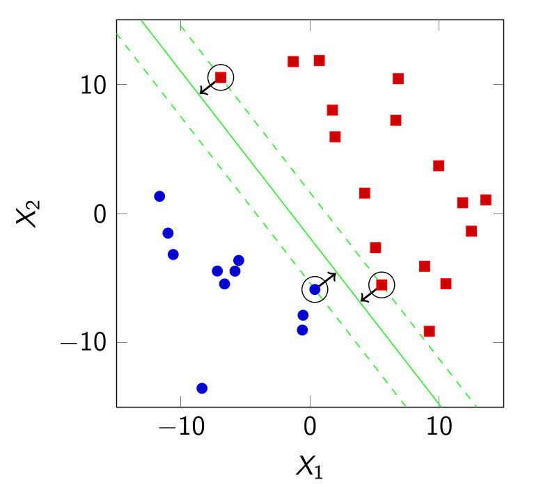

# Fundamentals of Machine Learning

## Introduction to machine learning systems

### Definitions of Machine Learning and Data Mining

Let's start with a definition of machine learning, a subset of the more
general Artificial Intelligence topic. *Machine learning* is the science
of getting computers to learn, without being explicitly programmed. We
want a computer to do something, but we don't want to *explicitly
program* the machine. The machine itself is just an executor, the goal
is to make it learn new stuff autonomously - and correct eventual
errors.

In a typical program, we would have needed to explicitly declare
instructions through algorithms and expressions. Machine learning comes
in hand, providing methods to get the machine learn by itself.

This definition puts a focus on the concept of the *machine*, from
a point-of-view of an Electronic Engineer. A Data Scientist would
have put an accent on the aspect of data involved in a Machine
Learning program.

Another important definition is *Data mining* or *data analytics*, which
is the science of discovering patterns in data. This concept is less
popular than Machine Learning, and it helps find patterns in data. For
example, we can use a Data mining approach when we need to understand
some hidden relationships in the data we have absolutely no clue of.
This task doesn't really involve 'learning', as there is only a *task*
to be accomplished: find patterns in a data set.

Ultimately, **the trick is that the same methods can be applied for both
fields.**


### Supervised and unsupervised learning

Machine Learning is a set of mathematical and statistical tools for:

1.  building a model which predicts an output, given an input (this is
    called *supervised learning*);

2.  finding hidden relationship and structures in data (this is instead
    called *unsupervised learning*).

In supervised learning, `<input, output>` pairs are made available to
the machine. What we do, is giving some *examples* of pairs to the
program, which will ultimately learn from them. The amount of examples
represents the *human supervision* part of the learning. This is what we
will first learn in this course.

In the other - unsupervised - model, the goal is different: we want to
find something that *we don't have any clue of* in the data. We are not
giving any sample to the machine: the data is already there to be
analyzed, and actually relationships are yet to find.

Indeed, given those definitions, it's quite straightforward to realize
that the first model is closer to the definition of Machine Learning,
while the second one is closer to the Data Mining definition. Since the
latter involves a machine analyzing data only without receiving any kind
of input examples, we consider it as unsupervised - the other way
around, we must supervise a machine learning system of the first kind by
providing proper examples as inputs, therefore this will be considered a
human supervised approach.


### A model of the \`classic' and the \`Machine Learning' machine

A classic machine can be represented with a *black box* model, defining
its own *interface* which has two inputs (the *data inputs* and a
*program*), whose final results are *outputs*. So the classic machine
requires an entire program as an input. That is usually written by a
programmer (or a team of programmers). Data inputs are also necessary,
and altogether with the program the machine operates the inputs and
provides the desired outcome.

One big advantage of the black box model is that it allows us to not
take care of *how* the elaboration happens inside the machine - what are
called the internals. Everything that happens inside the machine is
completely *obscure* (that's why the model is so called), what matters
to us are only its inputs and outputs. For the same interface, there may
of course be more implementations of the internals, so a classic machine
is fully *interchangeable*, provided the interface remains the same.
Since a classic machine requires a *program*, we must beforehand know
exactly how to process the input to get the correct output. Without such
knowledge on how to solve the specific problem, we are not able to build
the correct program for the task.


The new paradigm is the Machine Learning system. Suppose we *don't know*
the program and how to process the input. What we instead know are some
*examples* of correct answers to the problem. Thus, what we do is giving
those examples to the machine, and let the machine actually build the
program as the output for us. 

The program in output is also called *Model*, due to the fact
that it provides some meaning to the couples `<input, output>` we
gave as an input to the machine.

Overall, the Machine Learning
software is a program that, when ran, outputs another Program, which is
built on top of the examples given by humans. In reality, this approach
is quite similar to what humans already do (for instance, this is called
*human learning*), for when we build a program we process inputs, do
some reasoning about how the program should be done, and finally build
it.

visualization has a separation between the interface (inputs, outputs,
parameters) and the actual implementation.

{width=350px}

Since this document is written in Org Mode, the visual syntax, for
simplicity, will be as follows,

            params
               |
               |
               V
    IN ---> | machine | ---> OUT

where there are the inputs in the left (IN), the outputs on the right
(OUT) and some parameters entering \`from above' (parameters will
actually make sense in the future).


#### An example: spam detection

An e-mail spam detection filter is nowadays built with a Machine
Learning approach. The human approach to solve the problem is flawed to
begin with: first, there is a too big *scale* (there are too many spam
e-mails in an organization), which represents the main issue that drives
the adoption of the Machine Learning method. Then there's also a matter
of *privacy* (there may be concerns, for humans tend to personally judge
content in e-mails) or accuracy of humans at detecting spam e-mails. An
automated system would solve all these problems.

We first define the input format (for example, e-mail could be seen as
strings). The outcome is a decision, namely a binary one: `spam` or
`not spam`. The inputs are e-mail examples of `spam` and `not spam`.

This problem is better solved with *supervised learning*, because in
this case it would be trivial to provide a list of good - verified -
examples in a form such as `<e-mail, isSpam>`, where for each e-mail a
boolean flagging a spam is associated. In this case, we would need to
properly create those examples before providing them to our machine
learning system.


#### An example: flight operator

Let a list of flight trajectories be available as data to be analyzed.
We're asked to find out if two international flights over the same pair
of `<origin, destination>` follow the same trajectory (there are many
problems if two flights are crossing the same paths, involving safety,
increased costs and so on). This approach could be likely solved with
*unsupervised learning*: a possible approach is, in fact, to take
trajectories data (precisely defining what a trajectory is) and then
look for *grouping*: trajectories in the same group are - more or less -
the same. This approach that involves analyzing data is, therefore,
suited for an unsupervised kind of learning.


#### An example: image understanding

An example which widely applies to real cases is *recognizing objects in
images*. A typical example of this is photo managing, face recognition,
and many other useful applications. There is a very complex way to
achieve a solution, which involves further knowledge. A solution is
likely a mix of the two - supervised and unsupervised - approaches
(mainly supervised due to the low difficulty to produce many examples of
pictures with a correct label).


#### An example: authoring regular expressions

A regex (REGular EXpression) is a sequence of characters that specifies
a search pattern. Usually such patterns are used by string-searching
algorithms for "find" or "find and replace" operations on strings, or
for input validation. We are asked to build a program that's able to
take a text and an expression to extract as an input, and to produce the
proper regular expression to perform such extraction correctly.

A tool that assists us in generating the correct regular expressions is
`RegexGenerator++`. In this case, the Machine Learning system could be
described as a `string` and a `collection` (of strings to find) as
inputs, and a regex to find them as output. In this case, the problem is
solvable in both supervised and unsupervised methods. In the supervised
method, the example is given by `<t, E, rgx>` where `t` is the text, `E`
denotes the *extractions* (we want to extract the strings in `E` from
the text `t`) which can be specified as `E = {ect, ...}`, and `rgx`
denotes a regular expression given as outcome example. The best solution
for this problems is, however, *evolutionary optimization*, which will
be covered later in this course.


### Reasons to use a Machine Learning/Data Mining approach

One of the main reasons why Machine Learning/DM is so widely popular
nowadays is that they make advantage of both modern big data
availability and increased computational power (with memories greater in
size less and less expensive). The cost of stored data has exponentially
decreased during time (to the point that nowadays a machine learning
approach is completely feasible). Today then, storing a single Gigabyte
costs less than $0.10\$$. Another reason why such systems are so
popular is because there is an increasing demand to solve problems that
we are not yet able to write down a general solution - but instead we
have many examples of those solutions (in fact - we have a lot of data,
but we don't possess the information regarding how to solve the
problem). Moreover, machine built computer programs costs will
ultimately decrease, to the point that it will cost less than human made
programs.


### Aims of the course

Create your program from the beginning (requirements) to the end. In
particular,

1.  *design*: what is the problem to be solved? (a *formal* description -
    e.g. something `X` as inputs, something `Y` as outputs - this passage
    is crucial. This is called *problem statement*.) Which are the best
    techniques? How should data be prepared (number of examples, cost of
    them, "are there examples at all?")? Does computation time matter?
    (hardware on which Machine Learning runs and its outcome delay
    depends mostly on whether performance is a mission-critical factor of
    success or not);

2.  *implement*: writing code to create such program;

3.  *assess experimentally* (solution quality, solution generality):
    measuring solution quality, comparing solutions with other ones, "is
    my solution general?"). Keep in mind that the quality of the solution
    depends on the problem, not on the solution - for instance, it is
    always possible to determine the quality of a solution intrinsecally
    from the problem. The generality of the solution means that a general
    solution still proves useful after some time - and can be used again
    in the future.

A solution must ultimately be:

1.  *technically sound*;

2.  *economically viable*;

3.  *in its larger context* (there must not be any privacy, ethical or
    legal issue).


### A complex example: the amateur botanist friend

Suppose that there's a friend of ours - an amateur botanist - that wants
to recognize an *Iris* plant from three different species: *Iris
setosa*, *Iris virginica* and *Iris versicolor*. He wants us to employ
machine learning techniques to do so.

How do we help him?

First of all, we assess the risks. In this specific case errors are not
mission-critical: failures could be okay, because there are not human
lives involved.

Then we must define the problem statement: let's assign *exactly* one
species to a sample. For instance, let's assign a *label* to each sample
of flower,

    flower sample ---> | machine | ---> label

in particular the output is one among three possible values (a label
that identifies a flower species). The output has the following form,
$$y \in C = \{I.setosa, I.virginica, I.versicolor\},$$

where $C$ usually denotes a *collection* of labels, with $y$ being a
single element of such set.

Given this formal problem statement, we can choose among many possible
ways to accomplish the task:

-   The plant sample cannot be really provided in natural language,
    despite being capable of building a machine to read and interpret
    words. This is also a bad idea, because we would have to provide
    enough text samples, which must be long enough to be understood by a
    machine (the cost of writing down description is too high for the
    task);

-   the second option is taking a digital photo of the flower and assume
    the species from its appearance. This option is a lot cheaper, because
    it's straightforward to just take a picture of a flower. In principle
    this is a good idea, but for this exact problem there are many issues,
    such as poor quality of picture data (the photo must be taken really
    carefully, or with a specified protocol. That would increase costs)
    and difficulty of the task of image recognition;

-   another option is extracting information from DNA sequences. This
    option in principle is very good to recognize flowers, but costs are
    several times higher than the previous approaches due to DNA
    extraction costs. Despite being a feasible way, costs are too high for
    this kind of task (which doesn't even require the DNA sequencing
    accuracy level). This approach would, however, ensure the highest
    accuracy among the methods;

-   Finally, the correct approach is taking some measurements of the
    sample. Simple measurements could be detailed enough to build a decent
    machine learning program. Our friend has got the necessary expertize
    in the botanical domain to perform those measurements without issues.
    Costs here are really low because only 4 measurements are required.
    Because our friend has enough knowledge in the domain, this kind of
    approach has the proper quality with low costs.

The problem statement is as follows,

    sepal length and width
    petal length and width in cm ---> | machine | ---> y \in C (actually flower type)
    
    example: (5.1, 3.5, 1.4, 0.2) ---> I. set

A good approach to define a good example is taking the 4 longest
measures and consider them as the input to provide to the machine. This
is a complete description of the input and the output, and the goal -
namely it is a correct problem statement.

There's also other information. Our botanist friend asked a senior
botanist to inspect several samples and label them with the
corresponding species. Our friend's friend provides as one measurement
example for each flower, plus another one for *I. setosa* who has been
provided for us by our friend directly.

We can put them in a table such as the following:

   sepal l   sepal w   petal l   petal w       species
  --------- --------- --------- --------- -----------------
     5.1       3.5       1.4       0.2       Iris setosa
     4.9       3.0       1.4       0.2       Iris setosa
     7.0       3.2       4.7       1.4     Iris versicolor
     6.0       2.2       5.0       1.5     Iris virginica


Rows are actually the input variables (measurements) - for each one the
output variable is defined (the species). Input variables can be thus
called independent variables (we assume that those 4 values are independent and interesting to
define a species, namely those variables are independent
altogether and are all needed to provide the output), features or attributes. Output
variables can instead be called dependent variables (these depend on the
inputs), or responses (term taken from statistics studies). Columns are
descriptions.

We can then build a matrix that describes the input data (this is the
common mathematical notation to label these entities),

$$X =
\begin{pmatrix}
x_{1,1} & x_{1,2} & \cdots & x_{1,p} \\
x_{2,1} & x_{2,2} & \cdots & x_{2,p} \\
\cdots & \cdots & \cdots & \cdots \\
x_{n,1} & x_{n,2} & \cdots & x_{n,p}
\end{pmatrix}$$

with each line being an *observation* (also named *instance* or *data
point*) composed by $p$ variable values, and another one for the
output data,

$$y = \begin{pmatrix} y_1 \\ y_2 \\ \cdots \\ y_n \end{pmatrix}.$$

There are different notations, for instance

-   $x^{(i)}_ {j}$ instead of $x_{i,j}$;

-   $m$ instead of $n$ and $n$ instead of $p$ (latter is
    the most common choice);

-   many ones!

so the important stuff is focusing on the meaning.


The visual interpretation is as follows, provided we temporarily apply a
semplification for which there's no petal measurements and only some
variables within two species (this is kind of called a *classification
problem* - when only two values are possible this is called a *binary
classification problem*). Since it's not always possible to visualize
the data, the ideal condition is that of a binary classification setting
(this is why we oversimplified the original problem). Given a flower, we
choose that our system must provide one from two colors, red and blue,
depending on the flower species.

If we plot the data, we obtain the following scatterplot, in which we
can clearly see two patterns, for each corresponds a single kind of
label.

between the two species


Now, for each new point of data, let's assign it automatically its
proper label. In particular, given the following visual description of
the problem,

    (x_1, x_2) ---> | ML | ---> y \in \{red, blue\}

where $x_1$ and $x_2$ are input data passed to a machine learning
system, and $y$ is one of the two possible colors of output, the
feasible solution is obtained through two distinct passages:

1.  the first phase is letting the machine learn a model - called
    *classifier* - in this specific case it would be the model that
    apprehends the correlation between position and data point color.
    This model will ultimately produce the green line depicted in the
    graph. This phase is is called the *learning phase*;

2.  the passage that follows is the simple application of what learned in
    the previous step, to new data. Program has learned from data and
    actually built a model, from which it can infer the correct output,
    given a new input. This phase is instead called the *predicton
    phase*.

The overall technique can be visually represented as two subsequent
passages, the learning phase and the prediction phase. Hence,

    x, y ---> | learn | ---> model
                   |
                   | model (as parameter to next step)
                   V
    X   ---> | prediction | ---> Y (label)

which employs two different machines, one for each step involved. Notice
that the model - outcome of the first learning step - is provided as a
parameter for the second phase. Prediction phase makes use of the
previously created model to guess of which type is the new sample
provided as input.


### Choosing a model among many possibilities

When solving a problem, we typically need three steps:

1.  explore the data;

2.  apply one or more ML techniques;

3.  assess learned models.

There are many possible models, indeed. The one to choose depends on how
you compare different models (typically by cost and effectiveness - but
there may also come in aspects of familiarity with tools, developing
costs, and so on).

Ultimately, with machine learning we are modeling a dependency of $y$
on $x$.

1.  Comparing with cost

    Choice of the model is also determined by costs:
    
    -   problem size ($n$ rows and $p$ columns);
    
    -   availability and nature of an output variable $y$;
    
    -   computational effort (during both learning or prediction phase - this
        depends on mission-critical aspects of the problem, for which we
        cannot afford long computational times. For instance, we would need to
        refresh periodically the model, which requires a fast learning phase.
        The same goes for the prediction phase.);
    
    -   explicability of the model - it should be understandable by humans.
        The outcome is important in some situation, for example a surgeon
        helper machine, for which the output must be clear and concise for
        non-technical users too;
    
    -   and more depending on context.

2.  Comparing with effectiveness

    Is the model reliable with new data? We are interested in how well the
    output model works with new data, and this may differ between models.
    System must also be *repeatable* and *reproducible*: it must provide the
    same outcome over time and over many experiments (repeatable), and must
    be detailed enough to be reproduced in different environments
    (reproducible).
    
    A system to measure performance can be the following, employing the
    so-called performance index:
    
        ML data ---> | assessment | ---> performance index
    
    Performance tests must also comply with repeatability and
    reproducibility. This is important to actually scientifically verify the
    effectiveness quality of a method.

3.  Reasons why a system may not work

    An important aspect is the *error rate*, counting the times when the
    machine learning system gives a wrong output. Formally, even wrong
    output is a solution since it complies with the problem statement.
    Assume we solved the problem in the most simple way we could find: this
    way is called *baseline*. A baseline is the simplest program possible to
    solve a problem, and it represents our starting line.
    
    Fundamentally, we need to have a baseline from which we can compare if
    our system is working properly well. Such a baseline allows us to make
    comparisons between our system and the basic - simple - one. Each added
    complexity to our system must therefore *improve* the quality of our
    system, or it would not be worthy of being introduced at all.
    
    Another important aspect is data quality. Indeed, a system may not work
    if the data:
    
    -   is not informative (data does not have enough information included to
        assess the problem);
    
    -   is not representative (data does not represent real case scenarios);
    
    -   has changed during time (dependency between $y$ and $x$ changes
        overtime, therefore model is no more accurate after some time);
    
    -   is too noisy (measurements of data suffer from low signal to noise
        ratio, or errors in collecting data).
    
    Solution for these problems will be discussed later in the course.


## Fundamentals of R

Good available software choices are - for sure - general purpose
languages such as Python, Java common libraries (`haifengl` for Java,
`scikit` for Python), and specialized software environments such as
Octave and **R**. The latter is the tool that will be in use in this
course.

Various things must be considered when choosing your own development
software/platform, for instance:

-   *production/prototype*: is our system going to work in a production
    environment? If so, software must be carefully chosen to be compatible
    with production platform;

-   *platform constraints*: platform may be a determining constraining
    factor for software choice;

-   *degree of data customization*: some software already provides some
    maths calculations, that are useful depending on the problem. Making
    use of them may be a clever strategy;

-   *documentation availability and community size*: this comes in hand
    when looking for help;

-   *previous knowledge and skill*;


### R language

R is together a programming language and a software environment, which
has its own IDE built on R, *RStudio*. We will use R together with
`dplyr` (family of tools and packages for data manipulation) and
`ggplot2` (graphical plots)

1.  Data types

    R is not a strongly typed language, and performs implicit conversions
    automatically - there's no need to define a data type when declaring a
    variable. It has five basic types,
    
    -   numeric - a number;
    
    -   character - a char;
    
    -   logical - which is a boolean;
    
    -   factor - data objects which are used to categorize the data and store
        it as levels. They can store both strings and integers. They are
        useful in the columns which have a limited number of unique values.
        Like "Male, "Female" and True, False etc. They are useful in data
        analysis for statistical modeling;
    
    -   function - functions are actually data values in R;
    
    and four composed types,
    
    -   vector - vectors are a sequence of values with same data type;
    
    -   matrix - multi-dimensional vector;
    
    -   data frame (it models a table);
    
    -   list - aggregation, sequence of variables with non-homogeneous data
        type. For instance, one may declare a list containing a sequence of
        both characters and numbers;

2.  Value assignment

    It happens this way,
    
        vector v = c(1,2,3,5)
        matrix m = matrix(v, 2)
        data frame d = data.frame(v, 2)
    
    where `c` is a function which concatenates values and `matrix` accepts a
    vector and the number of rows. The same goes for data frames assignment.

3.  Importing and exporting data

    Comma separated values (.csv files) may be imported using `read.csv()`
    and `read.csv2()`. Writing happens with `write.csv()` and - of course -
    `write.cvs2()`.
    
    External R representations can be saved or load using, respectively,
    `save()` and `load()`.

4.  Summarizing data

    To summarize the data (explore it) we use a powerful command such as
    `summary(d)` where `d` denotes the data. Another option is using
    `skim(d)` from `skimr` package.
    
    Summarizing data makes possible to obtain an overview of a table
    containing lot of data. It allows us to avoid some common errors - such
    as dirty data (corrupted file) or wrong type variables. `NA’s` indicates
    *not available data* in such column.

5.  Selecting data in vectors

    Given
    
        vector a = c(1,3,7:10,17)
    
    let's:
    
    -   pick a simple element: `a[3]` access 7 (careful: it starts from 1!);
    
    -   more elements at once: `a[1:4]` access 1,3,7,8;
    
    -   more elements: `a[c(1,5,6)]` access 1,9,10;
    
    -   all, but some elements: `[-c(1,5,6)]` access 13,7,8,17;
    
    -   with a mask: `a[c(T,F,F,F,F,F,T)]` access 1 and 17;
    
    -   by condition: `a[a>8]` access 9,10,17;
    
    -   by condition (2): `a[which(a>8)]` access 9,10,17;
    
    Which function receives a boolean vector, and returns the indexes for
    which the condition is true.

6.  Selecting data in data frames

    -   one specific element: `d[3,2]` access 4;
    
    -   one row: `d[3,]` access 7,4;
    
    -   one column: `d[,2]` access 2,10,4&#x2026;;
    
    -   one column (by name): `d$dist` access 2,10,4&#x2026;;
    
    -   one column (by name as a value): `d[,"dist"]` access 2,10,4&#x2026;;

7.  Infos on data frames

    To get some basic information about a data frame,
    
    -   size: `dim(d)`, `nrow(d)`, `ncol(d)`;
    
    -   row/column names: `names(d)`, `colnames(d)`, `rownames(d)`.
    
    Names can of course be changed:
    
        names(d)[2:3] <- c("FancyName1", "fancy.name.2")
    
    where the arrow will change the second and third column name into these
    two names (assignment operator can be used too).

8.  Plotting graphs

Plotting graphs can be done with the `plot()` command, which will
    hopefully work with anything you provide as input. The `ggplot2`
    library can also come in hand.
    
    Plots are important to visualize data correctly. A plot is, in fact, no
    more than a *visual question to an answer* - therefore, you first need
    to know the correct question; then and only then you design a plot.


# Tree-based methods

The first kind of model that we are going to build is basically a tree -
a *decisional tree*. A decisional tree is a type of tree in which we
start from the *root node*: depending on the condition, a path can lead
either to a node or another condition node, called *branch node*. From
each branch node there at least and not more than 2 distincts paths. A
node that is below another in the decision tree is called *child node*
of the one directly above it, while the latter is named *parent node* of
the one below it. A node that is at the very ending of the tree - that
has no children - is called *leaf*.


## An example: the carousel

Suppose we have a carousel, for which we must replace the attendant with
a robot that automatically decides who can ride the carousel. People
below a certain age `a` and height `h` cannot ride the carousel. The
problem is to find the correct age and height criteria from the data
provided.

First, we analyze the problem and state it formally and correctly
(formal problem statement). Independent variables are $a$ and $h$,
and the dependent variable is the outcome $y$. Since the depent
variable has only two possible values, `{ can ride, cannot ride }`, this
is a *binary classification problem*. Such value will lead to perfect classification of each data set
point into the tree. An exception to this is when two data points
independent variables values are overlapping, but they yield a
different dependent variable colors. In such scenario, our
algorithm can never perfectly classify each data set point.

If we take a look at
Figure; the data we provide to the robot as an
input to analyze (supervised model), we find that there are two
different clusters of people, ones that can ride the carousel and ones
that cannot ride it.


### Implementing prediction phase

We can thus divide our set into 2 portions, one where age is below 10,
and the other where age is above 10. This is clearly seen in the data.
We then create the first passage of our *decision tree*: if
$\mbox{age } < 10$, a person cannot get into the carousel. The passage
that follows is the second step of our decision tree, filtering heights
below $120cm$. Those are arbitrary numbers infered by looking at the
graph - in fact analyzing available data with our human eyes and
intuition.


This is a human-like reasoning, which can be used by machines as well.
With cutting our data set with age equals to 10 and height equals to
120, we can still see that some points are not correct - they happen to
not fall in the correct category - but this is still quite good for our
model, and we will see it later why. Finally, our decision tree can be
visually designed such as the following,

            | a < 10 | <- this is the root, and a branch node
             /     \
            /       \
    leaf-> T (blue) | h < 120 | <- this is a child, and a branch node
    node              /    \
                     /      \
                    T (blue)  F(red) <- these are nodes

where each true statement leads to a blue (cannot ride carousel) node.
Only an input which corresponds to both conditions as false can reach
the red leaf node, which means the input is in the red portion of our
data set.

We manually infered a model from data observation. This decision tree is
therefore our model for the prediction phase, which means we can send it
as an input to the prediction machine. Such model allows basic
prediction of new input data, putting it in the correct categories. In
the following section we will cover up how to realize the learning phase
with code.


### Implementing learning phase

Now let's find out how to build a decision tree only providing data,
implementing the learning phase according to the problem.

The first technique is called *dividi et impera* (divide and conquer),
which employs recursion:

1.  we first find a cut variable and a cut value;

2.  for left-branch, we then recursively apply the same algorithm (dividi
    et impera again for values that are left to the cut);

3.  for right-branch, we also recursively apply the same algorithm
    (dividi et impera again for values that are right to the cut);

Practically it means exploiting recursion to put the same idea for each
subsequent portion of the data set. Each portion of the data set is
carefully chosen with a specific criteria (It has such name because the method is repeatedly \`folding' our
data).

We can then realize the function `BuildDecisionTree()`, which accepts as
input the input matrix `X` and the output vector `y`. For example, by
using pseudocode, a solution can be roughly

    function BuildDecisionTree(X, y)
            if ShouldStop(y) then
                    y_hat <- most common class in y
                    return new terminal node with y_hat
            else
                    (i, t) <- BestBranch(X, y)
                    n <- new branch node with (i, t) // x_i < t
                    // left subset
                    append child BuildDecisionTree(X with xj < t, 
                        y with xj < t) to n
                    // right subset
                    append child BuildDecisionTree(X with xj >= t,
                        y with xj >= t) to n
                    return n
            end if
    end function

Like every recursion function, it needs something as a `ShouldStop(y)`
function which interrupts recursive calls, otherwise it would run
forever.

Algorithm works as follows: if it's the last step and we need to stop
growing the tree, the algorithm will save into $\hat{y}$ the most
common $y$ class (for example, if a majority of blue points are living
into the last portion of the set, it will set as $\hat{y}$ the blue
class since it's more frequent than red class). It will then return also
a new terminal node corresponding to the $\hat{y}$ one (this will be
one of the leaves of our tree, for the algorithm has just stopped).
Thus, a terminal node is built with its corresponding $\hat{y}$ color
(in this example case blue, since we cannot further divide data and
apply recursion to left and right branch).

The else branch decides a cut variable, a cut value, then it applies
recursion (the same `BuildDecisionTree()` function to the left and right
branch (this is done by partitioning `X` and `y` into left and right
subset, in code this is noted with mathematical notation). The `(i, t)`
is a notation where `i` is the index of the independent variable and `t`
is a number such as $t \in \mathbb{R}$ (in fact, $i$ identifies the
input variable to be cut and $t$ denotes the cut value in the original
set). Then, the function `BestBranch()` will capture the best possible
branch from input data `(X, y)`. Workings of such function will be
covered soon.

This method can be called *binary splitting*, with a *top-down
approach*, because we start from the entire data set, subsequently
dividing it in smaller chunks, with only two possible subdivisions of
the original set.


#### Choosing the best branch

The `BestBranch()` function is so defined,

    function BestBranch(X, y)
            // we will pick the fewer possible number of wrongly placed points
            (i1, t1) <- argmin_{i,t}(E(y with xj >= t) + E(y with x_j < t))
            return (i1, t1)

So the correct branch is picked up by choosing the one combination of
two subsets with the least possible number of wrongly placed points. For
instance, let a subdivision have a majority of blue elements, and a
minority or red elements. Red elements will then be marked as *wrongly
placed*, while blue ones will be correctly placed. The best choice is
the value of cut that creates two different subset, having both the
minimum amount of wrong elements.

Let's classify error $E$ on subset:

$$E(y) = \frac{|\{y \in y : y \neq \hat{y}\}|}{|y|},$$

where $\hat{y}$ is the most common class in the $y$ set. Numerator
means all wrong values, where denominator is the counting of all values.
This approach is called *Greedy*, because it minimizes the number of
points in the wrong side of the division, and thus maximizing correctly
placed points. Since this is a minimum condition, this can be definitely
reduced to an optimization problem.

The best branch is determined with the formula

$$(i_1, t_1) \rightarrow \mbox{arg}\min_{i,t}{(E(y|_{xj >= t}) + E(y|_{x_j < t}))},$$

where the $\arg \min$ determines the specific *argument* that yields
the minimum value of which we must implement the code.

The criteria for the best branch can be defined with the *error rate
index*,

$$E(y) = \frac{|\{y \in y : y \neq \hat{y}\}|}{|y|} = 1 - \max_{c}{\frac{|\{y \in y : y = c\}|}{|y|}} = 1 - \max_{c}{p_{y,c}}.$$

The term $p_{y,c}$ denotes the amount of points of a specific color in
the subset $y$, with $c$ the set of possible outcomes (red or
blue). We should be careful to not decrease representativity of the data
by splitting it into wrong data subsets.


The error rate index is the simples of all indexes, but it isn't very
reliable. Better indexes can be then used in place of it. So, we can use
two more indexes,

-   the *Gini index*, which is defined as
    $$G(y) = \sum_{c \in C} p_{y, c}(1 - p_{y, c});$$

-   the *Cross-entropy index*, that is
    $$D(y) = - \sum_{c \in C} p_{y, c}\log{p_{y, c}}.$$

Those two indexes are generally a lot better than the error rate index,
because they are smoother at the centre, and the smoother the better.
All indexes measure the *node impurity*, how many errors we have in the
current data. The last ones work better than the error rate index. For
all of them, the smaller the value, the better it is.

For optimization, error rate index angle is worse, as we can see in the figure.

. The angle is an undesired pattern, because in problem optimization sudden direction changes are very hard to manage to get the proper minimum location.")

Since this is a binary classification problem, the following
relationship holds,

$$p_{y, red} = 1 - p_{y, blue},$$

where the node purities can be reversed.

Multiclass problems are harder, but can still be achieved with a similar
approach, identifying the best branch algorithm by minimizing the amount
of errors looking at each combination of subsets.

Other useful properties of these tree-based method can be summarized as
follows,

-   trees can work with categorical independent values - this means we can
    use such values in `R` code when building trees;

-   branch node is $x_j = c$, or $x_j \in C' \subset C$ where $c$ is
    a class - a color in the example above;

-   can mix categorical and numeric variables together in `R` code.


#### Stopping the recursion

Regarding size of the problem, we should be able to tell whether the
problem has finite or infinite size. The actual size of the problem is an
$n$ number of points, with $p$ variables. Those numbers yield a
total number of attempts $n \cdot p$, which is finite.

The `ShouldStop()` function may be written such as

    function ShouldStop(y)
            if y contains only one class then
                    return true // stop recursing
            else if |y| < k_min then
                    // if number of observation is lower than a parameter called
                    // k_min, stop recursing
                    return true
            else
                    return false // keep recursing
            end if
    end function

We already told that every recursion function needs a stopping
criterion. Stop of the recursion, in this case, is triggered when we
reached the end of the tree (only one class), or when the number of
observations is lower than a certain $k_{min}$. Another possible
criterion could be a tree depth larger than a specified $d_{max}$, for
which we could stop our recursive algorithm. The latter is not
implemented in the algorithm above.


## Example of tree building given a toy problem


Let a set of data such as in Figure, which
has 3 possible color as the dependent variable outcome,
$c = \{ red, green, blue\}$. Size of the problem is $n = 11$ number
of observations, $p = 2$ number of independent variables, $|c| = 3$,
with $c$ the set of possible classes for the outcome.

We first manually execute the learning algorithm. During the first
invocation, we receive the entire set of $X$ and $y$. The first is
sized $11 \times 2$, while $y$ is just $1 \times 11$. A parameter
of $k_{min} = 1$ is provided to the algorithm.

    // First invocation
    BDT(11 x 2, 1 x 11)
            Stop ? -> NO, because we have 3 different colors
            // Lets start with x1 = 2
            // first check most common color then summing errors
            // for each combination
            x1,3 = 0 + 6/9
            x1,4 = 0 + 3/6
            x1,5 = 2/7 + 1/4
            x1,6 = 4/9 + 0
            x2,2 = 0 + 6/9
            x2,3 = 0 + 4/7
            x2,4 = 2/7 + 1/4
            x2,5 = 4/9 + 0
            // the minimum is x1,6 = 4/9
            // despite having x2,5 = x1,6, we pick the first

The corresponding node can thus be obtained

    | x_1 < 6 |
     /     \
    /       \
    T       F

Our algorithm will stop now in the False branch, because it receives a
fully-green $y$.

            Stop ? yes (we are in False branch)
            // we append a green leaf there
    BDT(9x2, 1x9)
            Stop ? No (in True branch)
            x1,3 = 0 + 4/7
            x1,4 = 0 + 1/4
            x1,5 = 2/7 + 1/2
            x2,2 = 0 + 4/7
            x2,3 = 0 + 2/5
            x2,4 = 2/7 + 1/2
            x2,5 = 3/8 + 0
            // best cut value is x1,4 = 1/4

So the new node will be

        | x_1 < 6 |
         /     \
        /       \
        T       F
       /
      /
      |x1,4 < 4|
      /   \
     /     \
    T       F

The True branch should stop, because we receive as input a full-red
$y$.

    BDT(4x2, 1x4)
            Stop ? NO, because there are 3 blue and 1 green
            // repeating algorithm will lead to a choice of
            // x2,5 = 1/4

Applying the last node,

        | x_1 < 6 |
         /     \
        /       \
        T       F (green)
       /
      /
      |x1,4 < 4|
      /   \
     /     \
    T(red)  F
             \
              \
              | x2 < 5 |
                /     \
               /       \
              T(blue)   F(green)

and that's the final result.

Let's build the prediction phase. Our nodes can be represented as a list
of 3-tuples (or matrix) of values, `< value, left, right >`, and
subsequent `if`s statements can help putting new data in correct
location.


## Tree complexity

What we are always looking for, is to build a model from real systems
data. If the model does not fit the data correctly, we say that *the
model does not represent our real system*. Indeed, this is a situation
that must be avoided.

Tree complexity measures how \`complicated' is a tree. An overcomplicated
tree is probably caused by poor data quality, or it may simply be the
manifestation of a hardly explainable problem. To reduce this problem,
we can implement some parameters, such as $k_{min}$. The role of
$k_{min}$ is to stop the algorithm before it reaches a single color
set (which is not always possible) and before our tree becomes too
detailed. For instance, with noisy or dirty data, there could be even
*errors* providing a too small $k_{min}$ value, for instance some last
part of a branch could be less representative of the data, as shown in
Figure. In this case, the tree is
*overcomplicated*: since the tree should resemble a real life context,
we are not interested in such detail.


The shortcomings of an overcomplicated tree are that it will be less
readable, understandable or explainable ($k_{min}$ value can be chosen with respect to the number of observations in the data.) ones - this can likely
caused by too much noise in the data, which our decision tree algorithm
doesn't recognize.

Of course, the less the $k_{min}$ is, the more complicated the tree
will become and the less flexible it will be - however, tree complexity
is also correlated to data, which we cannot directly control. Wrong data
could have been obtained with bad sampling, noise in measurement tools,
or simply human distractions.

Ultimately, complexity will be a combination of both $k_{min}$ and
data, and thus it can be defined as follows,

$$\mbox{complexity}(M) \sim X, y, k_{min}$$

When $k_{min} = 1$ (depth is defined as how many times a node is a child. For
instance, root node will have 0 depth, its children will have 1
depth, their children will then have depth 2 and so on.), the tree completely fits the learning data, but the resulting tree may not be a good description of the real life
scenario; in that case, we will say that the tree is **overfitting** (it
fits very well learning data, but not very well the system). Future
behaviors of the system could be wrongly classified, since noise in the
data provided wrong trees that do not resemble reality - we are not
interested in such detailed system. We say that such systems *do not
generalize*. Another way to call it is that there's too high *variance*
in the model. For instance, model will change a lot when a new model is
rebuilt when data is collected again, because new data will likely
contain a different manifestation of the noise and the algorithm will strongly adapt to it, to the point that it will be completely different from before. Such system is said to manifest a **high variance** with respect to the data.

In fact, learning about a model means collecting *observation* of a
phenomenon in a system $S$. Observation will produce couples of data
$X, y$ to provide as examples to the machine learning system. Such
phenomenon is then investigated by getting a *point of view* on it by
understanding, knowing and explaining $S$. However, if the learning
technique is not correct, changing our point of view may lead to a
different interpretation of the same problem $S$.


### Spot overfitting and the optimal complexity to better fit the problem

In our toy problem, spotting the overfitting was easy. This was because,

1.  we could look at the model;

2.  we had the expectation of complexity of problem;

3.  we had the data.

Let a machine learning system be, and let a parameter that varies
flexibility of the model, such as $k_{min}$, be provided to our
system. Procedure below explains how to spot overfitting in our model:

1.  we build our prediction model from the learning phase many times,
    each with a certain $k_{min}$. Points to the left in
    Figure have high $k_{min}$
    and thus high error index, while points in the right have low
    $k_{min}$ and low error index. We call the error index *learning
    error*. When testing our system, it can fail to predict real cases
    data: instead, such error is called *test error*, because it is the
    error determined by testing our machine learning system repeatedly
    with varying $k_{min}$;

2.  we get a lot of models, whose complexity increases;

3.  increasing complexity leads to less errors when we measure the test
    error;

4.  this happens until a certain point, when test errors start to
    increase following complexity;

5.  we should stick to the *minimum* of that curve, shown in
    Figure.

. In the middle, there's a minimum optimal spot for our model.")


### The k-fold cross validation

A previously unanswered question is how can we get the unseen data to
measure test errors for our machine learning system. This other data,
that we can call *data of tomorrow* or *unseen data*, must be provided
to find our optimal learning complexity. Such data can thus be obtained
by simply *pretending to have it* - this can be achieved by temporarily
ignoring a portion of our data set and use it to test our system later,
when we measure the test error. Of course, we will do this by repeatedly
varying our ignored portion of data set, and repeating the learning
system many times according on how we split our data set. This method is
named *k-fold cross validation procedure* (Gerardo Canfora et al. "Effectiveness of opcode ngrams for
detection of multi family android malware". In: Availability,
Reliability and Security (ARES), 2015 10th International
Conference on. IEEE. 2015, pp. 333&#x2013;340).

More formally,

1.  we first split data (both $X$ and $y$) in $k$ equal slices,
    each one composed of $\frac{n}{k}$ elements;

2.  then, for each $i \in \{1, ..., k\}$ split,
    1.  we learn on all but k-slices;
    
    2.  we compute classification error on the *unseen* k-th slice;

3.  finally, we average $k$ classification errors, using formula
    $$e =\frac{1}{k}\sum_{i=1}^{k}e_i,$$ where $e_i$ represents the
    error for each choice of slice we made, and the $e$ value
    represents the total averaged *error rate* of our system.

The purpose of this procedure is to measure the test error while not
having real future data. This way, we can better estimate future
behavior of our model, by repeating the above procedure for every
$k_{min}$ value.

How should we divide data? The common way is *randomly*, if a no better
way to split the data is available or achievable.

Methods to obtain good fitting of a model are:

-   using a large $k_{min}$;

-   limit tree depth when building, by setting a $d_{max}$
    parameter;

-   don't split if low overall impurity decrease when building (usually
    this way is provided in libraries);

-   *prune* (cutting branches) after building.

Pruning means we change our model according to the results we want after
we built it. A proper way to prune our decision tree can be implemented
in the following way,

1.  first, learn a full $t_0$ tree;

2.  then, build from $t_0$ a sequence of trees
    $T=\{t_0, t_1, ..., t_n\}$ such as
    1.  $t_i$ is a root-subtree of $t_{i-1}$ (for instance,
        $t_i \subset t_{i-1}$);
    
    2.  $t_i$ is always less complex than $t_{i-1}$;

3.  finally, choose the $t \in T$ with minimum classification (test)
    error, determined with k-fold cross-validation.


### An example: Android Malware Detection

Suppose we have an App Store, in which we have to scan
millions of applications for viruses and malware. Since the scale of the
problem is very huge, a machine learning approach becomes mandatory:
security experts - while having a good domain knowledge - cannot
possibly analyze so many applications. Our approach to the problem is,
indeed, of a supervised learning: what we need are the application
formatted as an independent variable, and a binary answer - yes or no -
as the dependent variable. What we know for sure is that the data set
can be collected by human security experts.

Therefore, prediction phase of our problem can be summarized by the
following diagram,

               Model
                 |
                 |
                 V
    app --> | prediction | ----> malware (y/n)

But what is an app? Since an app is a collection of files, describing
procedures in some programming languages, configuration files and
images, and many other file types, we cannot provide application files
as the independent variable in input, since such format doesn't fit our
requirements of fixed-size tuples of variables. So, we have to define
what are the independent variables.

In this phase, we must understand how to measure \`the app' in some way
or another, so that the measurements fit the input data format. We call
the first passage of our problem-solving *feature extraction phase*.
Feature extraction phase is crucial in determining both quality of our
solution and the questions we are going to answer with subsequent
approaches.

We must convert application files in a data set, as an $X$ matrix,
with some trick.

    app ---> | preprocessing / feature extraction phase | ---> X

Such data must also be something not too expensive to extract, must have
enough information to determine whether an application is a malware or
not, and must be good enough to be used in a machine learning system. As
we have seen in previous examples, this step requires enough domain
knowledge.

An app is a piece of software that exists in two possible states:

-   when *not in execution:* analysis performed when software is not
    executed is called *starting analysis*;

-   when *in execution:* such analysis is named *dynamic analysis*.

Information on what happens inside the application is mostly in the code
and more rarely on configuration files, but what can we do if an
application is not open-source? We need a way to extract some *features*
from the code: in the case where the source code is not available, we
might have to look at the bytecode.

In particular, we could obtain proper input data in the following way:

1.  take a piece of code;

2.  translate it in machine code (in this case, the machine code is
    interpreted by the JVM);

3.  each instruction will be a *symbol* in one of the possible symbols
    set;

4.  since we are not interested in the peculiar instruction, let's just
    consider the `opcode`, which is the name of the instruction;

5.  we now have a sequence of opcodes from an alphabet of opcodes;

6.  let's count the number of occurrencies for each symbol and put then
    in a vector;

7.  every application is described by a vector with a fixed number of
    entries $(\sim 100)$, each one containing the occurrencies of each
    symbol and thus representing our independent variable $X$.

Thus, what we are really asking is "how many times an instruction is
performed?". This question is related to the fact that for each opcode
instruction corresponds a different system call or set of system calls.
Malicious behaviors can then be infered by how many times some system
calls are improperly invoked.

A diagram follows the explanation:

    PREPROCESSING PIPELINE
    
                        JVM
    app ---> just code -----> machine code --------> just consider the  ---
                                                     opcode for each
                                                     instruction
    ----> for each symbol, count occurrencies
          and put them in a vector

This problem is not yet entirely resolved. There are, in fact, *malware
families* which are first determined manually, that share some
characteristics each other. New families constantly arise from time to
time: will our system recognize new malware from new families? Is our
system equally good at detecting malware of a new kind?

We can measure it by performing cross-validation in a clever way.

Let's add a new column in our data set, and call it $f$. We now have
input data in the form of $X$, $f$ and $y$. Such $f$ column, for
each $X$ and $y$ row, contains information on malware family
type (for instance, let's work with categorical values. Some family
types could then be `trojan`, `rootkit`, `ransomware` and so on). We can then split the error in a smart way such that the
unseen data of a selected slice will only contain a family which is not
present in the data provided to the learning machine, thus testing our
system with unknown families. For instance, we could slice the data in 3
parts, one containing only `trojan=s, one only =rootkit=s and the last
one with only =ransomware`-type malware. We then provide the learning
machine with trojan and rootkit kind of malware, and then leave all
ransomware as unseen data for test error measurements. This way, we can
understand if our system is good enough at detecting new families, which
are provided in the form of unseen data.

In dynamic analysis we have a further column, which holds the execution
number, because we are required to execute the program many times, for
each time we will get different data. A new column will be added, for
example as the $n$ column.

Ultimately, the key concept of this example is that the assessment part
of machine learning - namely our feature extraction phase - is very
important, because the way we design assessment procedure will change
the question we are posing and the answers we are looking for.


## Cross-validation for assessment

We can use previously quoted k-fold cross validation for problem
assessment. In particular, k-cross validation will specifically measure
how an artifact learned *with this learning technique* will behave on
unseen data by repeating the learning of the model. Cross validation
could also be used to determine the best value for the $k_{min}$
parameter, applying CV for several values of it. To do so, we basically
build two *nested* CV systems, the external one having no parameters and
considering many $k_{min,i}$ values when slicing our data set; the
internal one will accept $k_{min,i}$ as a parameter and perform a
second cross-validation on the data set provided that the external CV,
using the same $k_{min,i}$ for all CVs. Each CV will then recursively
yield the model corresponding to the minimum test error.


### The cross-validation algorithm

Let's consider the learning part, where we test $M$ different
$k_{min}$ values, each one $k$ times (k-fold). We will choose the
model that yields the lowest possible test error.

Let's build an example with $k_{min} = 10$, performing CV on a single
$k_{min}$ value,

1.  repeat $k$ times:
    1.  `BuildDecisionTree()` with $k_{min} = 10$, on all but one slice.
        This will give $\frac{k-1}{k}n$ observations in each $X$
        passed to `BuildDecisionTree()`;
    
    2.  compute classification error on left out slice;

2.  average those computed classification errors;

There were, in total, $k$ `BuildDecisionTree()` invokations (indeed,
it is called $k$-fold cross validation procedure).


### The nested cross-validation algorithm

The previous algorithm worked with a single $k_{min}$. In previous
chapters, we saw that $k_{min}$ has a determining role in assessing a
problem correctly - namely, it will determine the overfitting of a
machine learning system. We need to find out a way to guess a good
enough $k_{min}$ value, which will be called the optimal
$k^ * _ {min}$. Such value will minimize the test error for our systems.

Let's consider an external system, which automatically provides the
$k_{min}$ to the previously seen system. Let $m$ be the number of
possible $k_{min}$ values.

The algorithm is as follows:

1.  repeat $k$ times:
    1.  choose $k_{min}$ among $m$ values, with a - for example -
        10-fold cross validation (10-CV). This means we should repeat
        `BuildDecisionTree()` $10\cdot m$ times on all but one slice,
        which will be used for testing classification error. We have
        $\frac{k-1}{k}\frac{9}{10}n$ observations in each $X$ passed
        to `BuildDecisionTree()`;
    
    2.  compute classification error on left out slice. Usually, a new
        tree is built on $\frac{k-1}{k}n$ observations;

2.  average computed classification errors.

In total, there will be $(10\cdot m + 1)\cdot k$ invocations of
`BuildDecisionTree()`.

An example of this technique can be summarized by the two steps
depticted in Figure and
Figure.

Let a system be built as shown in Figure. The
scheme shows an outer \`box' that we will call *outer system* and an
inner box called *internal system*. The purpose of the outer system is
to provide multiple $k_{min}$s to the internal system, which is the
previously met $k$-fold cross validation system, repeatedly calling
the function `BuildDecisionTree()` with a portion of the data destined
to test error evaluation. The inner system will then
(Figure) determine an optimal $k^*_{min}$ to
use for the final system. The outer system will also perform its own
$k$-fold cross validation, therefore we will distinguish between the
outer $k_{out}$-fold cross validation and the inner $k_{int}$-fold
cross validation. The latter is also executed $m$ times, where $m$
is the total number of $k_{min}$ values the outer system will provide
to the inner learning machine. Hence, the inner system will perform a
$k_{int}$-fold CV $m$ times, each one with a different $k_{min}$,
and ultimately determine the optimal $k^*_{min}$. This entire process
is repeated $k_{out}$ times, since the outer system will perform a
$k_{out}$-fold cross validation. At the end of the overall process, we
will be able to determine whether our system is good or not at managing
unseen data.

How many times is the function `BuildDecisionTree()` invoked?

Let $n$ be the total number, we have

$$n = k_{out}(k_{int} \cdot m + 1),$$

where the additional call is performed by the internal system *after*
determining the optimal $k^ * _ {min}$, on the entire data set available
to the internal system.


### Errors when managing unseen data

The outer system in Figure performs an external
cross validation of the data set. The reason why we must perform a
second cross validation is because the $k^ * _ {min}$ is determined by a
cross validation from the internal system. Conceptually, this way of
fitting $k_{min}$ is similar to the way we build the three, because
the role of $k^ * _ {min}$ is to *minimize the test error* - the same
goal as the tree building process. This means that if we forget to
perform the external cross validation, we are committing an error.

Unseen data means that such data cannot be used to build a model. If we
do one single CV is like cheating.


## Regression Trees

Regression trees are trees that are used for regression instead of
decision. This means that, in this case, $y$ is a numerical value
instead of a categorical one. While independent variables do not change
in nature, the dependent variable is now $y \in \mathbb{R}$.

Let's build an example algorithm,

    function BuildRegressionTree(X, y)
            if ShouldStop(y) then
                    // mean is the minimum error
                    y_hat <- the mean of the values in that class
                    return new terminal node with t_hat
    
            else
                    (i, t) <- BestBranch(X, y)
                    n <- new branch node with (i, t)
                    append child BrT(X left, y left) to n
                    append child BrT(X right, y right) to n
                    return n
            end if
    end function

It looks similar to `BuildDecisionTree()`, with the notable exception
that now the $\hat{y}$ node will contain the *mean* $\overline{y}$,
which - by definition - minimizes the error between data points in
$y$.

What should we change of the `BestBranch()` function to apply our
knowledge on regression trees?

    function BestBranch(X, y)
            (I1, t1) <- arg min_i,t E(left) + E(right)
            return (i1, t1)
    end

our old algorithm is meaningless, because we cannot compute error on
$y \in \mathbb{R}$ in such way that we simply count occurrencies. We
must change the way we think of the error. Luckily, residual sum of
squares (RSS) comes in hand.

RSS is defined such as

$$RSS = \sum_{y_i \in y : x_i \geq t} (y_i - \overline{y})^2 + \sum_{y_i \in y : x_i < t} (y_i - \overline{y})^2$$

Generally, the domain of the $E$ error for both classification and regression tasks is $$E(\cdot) \in [0,1],$$ because test
error is defined as
$$E(\cdot) = \frac{\left|y = \hat{y}\right|}{\left|y\right|}$$ where
$\left|y\right|$ denotes the sum of all values in the set.

Differently, $RSS \in \mathbb{R}^+$ where $0$ is best case. Thus,
RSS cannot be used to compare different models since *it depends on the
scale of the problem*.

Regardin the stopping criterion,

    function ShouldStop(y)
            // the stopping criterion changed
            if RSS is 0
                    return true
            else if |y| < kmin then
                    return true
            else
                    return false
            end if
    end function

the main difference is that the algorithm will stop *when residual sum
of squares is zero*.


## Tree model overfitting

Trees are *simple*. They are the only one models that can easily be
exaplinable with words, and one of the few machine learning techniques
we can quickly understand and explain with simple words. However, trees
have some shortcomings. For instance, let's pick example depicted in
Figure.


The model itself is rather simple: $3$ straight lines, with a
different value, forming a step-like function that minimizes test error.
There are in total $3$ steps, which could be - roughly - summarized as
a decision tree. First step we ask if our data is $< 16$, then if that
condition is false, we further ask whether data is $< 24$. In the end,
we will assign a category for each class in the tree, that will be
represented by a decision tree such as

       | x < 16 |
         /   \
        /     \
       T       F
    y = 1   | x < 24 |
               /   \
              /     \
             T       F
           y = 3    y = 2

As we can see, such decision tree is quite simple, but it is a bit
unaccurate, in the sense that straight horizontal lines cannot always
describe our system properly, in particular they cannot *express the
nature of the system*. The system in
Figure clearly shows
a growth behavior in the beginning of the data set, and then it goes
down in the last portion. This behavior is roughly summarized by our
tree model we just trained, but such approximation is not really
accurate, in particular it doesn't express constant growth really well.


We can further analyze this behaviour in
Figure, Data first decreases from
$y \sim 30$ until $x \sim 300$, then it rapidly grows back to
$\sim 40$. If we pick different systems with varying depth (from 1 up
to 4), we have models of a different complexity. For instance, in the
model above choosing a depth equal to 1 will determine a not enough
complex tree. In particular, with a maximum depth of 1 there's *not
enough room for complexity* to allow our model describing the system.
For example, there's a single straight line with value $15$ describing
the entire left decreasing part of our data set, that's obviously not
good enough and doesn't describe our system properties.

Picking a depth of 2 yields a much better result. In particular, our
model is now a bit more able to describe our system's nature, regarding
its behavior.

Let's try increasing our model complexity. Picking a maximum depth of 3
already shows some signs of overfitting: around $x = 450$ we can
observe a sudden spike in our prediction value, and that's clearly not
what the system is doing. Incresing to 4 yields even more spikes,
localized roughly around $x = 480$ and $x = 20$.


## Tree-based models summary

Advantages of using tree-based models can be summarized as:

1.  they are easily interpretabile, explicable and understandable;

2.  learning phase is actually pretty simple to understand and implement;

3.  can handle both numerical and categorial values;

The main disadvantage - and actually the reason why we are often looking
for more complex solutions - is that **they are not always so accurate**.
In particular, accuracy depends on the kind of problem, as shown in
Figure.


Accuracy is worse in those cases when the boundary between data classes
does not follow a straight - strictly horizontal or vertical - line. In
particular, in graphs such as those in the first row, our tree will
struggle to determine a correct boundary between data categories using
**only** horizontal or vertical lines, since real system boundaries are
better described by diagonal lines. In that case it will be better to
use another kind of model, one which implements a diagonal lines
classification.

However, in data sets depicted in the second row, we can clearly define
a horizontal and a vertical boundary between classes. Cases like this is
where decision and regression trees shine the most, and have room for
actual implementation.


# Random Forests


## Issues with tree-based methods

Tree has its own weaknesses. Smaller trees

-   will have low complexity;
-   will hardly fit curves;
-   they have a high bias (bias is the idea that we have apriori knowledge
    of the problem and thus we don't have to use the data), and a low
    variance;

while bigger trees

-   will have high complexity;
-   may overfit noise;
-   have low bias and a high variance.

Summarizing, trees may have low details and low complexity, or fine
details and a huge complexity. However, high complexity will lead to
trusting too much the data.

Our idea is to combine different big tree views, and *ignore details of
which they disagree*. This way, we can avoid high data variance - each
variety of the data set will be cancelled by the combination of
different trees.


## Wisdom <del>of the crowds</del> of the trees

> *Wisdom of the crowds*: a collective opinion may be better than a
> single expert's opinion

The idea is to have *many views of the system* - namely, many different
trees of the same system with high variance. We then will combine them
in a single model. Multiple trees combinations allow to put together:

-   many views (we must collect many trees);
-   independent views (those views must be independent each other - this
    is a problem, since *learning is deterministic*. We must know how to
    overcome this issue);
-   aggregation of different views (we must be able to aggregate trees -
    for instance, the average prediction for a regression problem, and the
    most common prediction for classification problems);

with the idea that a *collective* view may be better than a single
opinion, no matter how expert it is.

Multiple views will remove noise in the data, and allow to collect only
features of our real system. This way we can build a lot of big, complex
trees, and make them communicate - **model details of our system that
will disagree with the vast majority of models will be dropped**.


## Overcoming deterministic nature of learning

We will shuffle the learning data just like $k$-fold cross validation,
but instead of taking a subset, we will get a *sample with repetitions*,
which is a sample of the original data with repetitions allowed (for
instance, items will be picked up from original sample data, but same
elements can be picked as many times as it happens). This, of course,
can be done with both `X` and `y`. Learning data size is not really a
limitation - we will use `n` as learning size (with repetitions).

We are okay with the fact that there are some repetitions, because this
way we are obtaining different views of the same system, *without
requiring to collect more and more data*. Of course, some data will be
more represented, but in the end this is a cost we are willing to pay to
avoid further data collections.

This process of removing and rearranging rows in our $X$ matrix is
called **bootstrap**.

Bootstrap happens *inside* our model - one could, for instance, add
$k$-fold CV on top of that (*outside* the model) since it's a totally
different procedure.


## Tree bagging learning

Tree bagging learning (model is a 'bag') algorithm can be writted as
such:

    When learning:
    1. repeat B times,
       1.1 take a sample of learning data, with repetitions allowed
       1.2 learn a tree (unpruned)
    
    When predicting:
    1. repeat B times,
       1.1 get a prediction from the i-th tree;
    2. predict the average or most common prediction

so `B` is a parameter, assuming that when learning we collect trees with
the *highest possible complexity* (we need variance, we need details).

We are using, internally, `B` times `BuildDecisionTree()` with a
$k_{min} = 1$.

We could also use different classifiers together; this technique is
called *ensemble learning*.


### The `B` parameter

We shall find the best value for `B`. Is `B` somehow related to
flexibility?

The answer is *no*. It is shown experimentally,

-   if `B` is very large, bagging is better than the single tree;
-   increasing `B` does not cause overfitting;
-   default `B` is usually okay-ish for the vast majority of problems
    (from $100$ up to $500$).

The cost involved in taking a huge `B` is the computational cost. The
largest `B`, the greater the computational efforts required.


### The Random Forest technique

The idea of forests arises from bootstrap. For instance, we are okay
with the idea to make many, independent, views. We can try to improve
our algorithm.

In fact, despite being learned on different samples, bagging trees may
present some *correlation*, since data sets are not really independent.
For instance, one variable could be much more important than the others
for predicting: that one is called *strong predictor*.

We can force more independent views of our trees by *hiding variables* -
this means we are discarding also columns instead of rows in our $X$
and $y$ data set. We are creating the condition for some trees to not
have a strong predictor inside their data set, thus increasing
independent-ness of our forest.

    When learning:
    1. repeat B times
            1.1 take a sample of the learning data, with repetitions allowed
            1.2 consider only m on the p possible independent variables 
                    (Main difference with previous algorithm)
                    (we drop p - m variables. They're not the same among trees)
            1.3 learn an unpruned tree
    
    When predicting: <----- Same as before
    1. repeat B times
            1.1 get a prediction from the i-th learned tree
    2. predict the average or the most common prediction

When we choose which variables to discard, we will do it *randomly*.
There are two sources of randomness in the model - the bootstrap
process, and the hiding variables procedure. The end result will be the
creation of a **Random Forest** of trees.


### The *m* hyperparameter tuning

How to choose the correct value of $m$?

$m$ value equal to $p$ would mean we are only performing bagging,
instead of hiding variables. It has ben experimentally shown that:

-   $m$ does not relate to overfitting;
-   $m = \sqrt{p}$ is good for classification;
-   $m = \frac{p}{3}$ is good for regression;
-   In a way, default value for $m$ is the best for us.

Random forests are one of the best, if not the best, multi-purpose
machine learning supervised classification techniques.


### The No free lunch theorem

The *"No free lunch theorem"* is a theorem with its own prove.

> Given any two optimization algorithms, they are equivalent if you
> consider all the possible problems.

Are we really interested in an algorithm that can solve *every possible
problem*? In practice, that's a sound no.

Why is it called the *No free lunch theorem*?

There's no single restaurants of the infinite possible ones where
everything is cheaper than the others. So, there's not a general answer
of where to eat. Things change when, for instance, we express a
preference (for instance, if we choose to eat pizza or to go vegan).

That's the same for ML.

We have a learning algorithm we must choose, and a problem we must
assess with the chosen algorithm. Price is a metaphor for the prediction
performance, while the customer is actually a ML expert.

Basically, theorem says that **without specifying a problem we want to
solve, there's no better algorithm than others.** We must pick our ML
technique according to what our problem requests.


### About observation sampling

Each learned tree uses only a portion of the observation in the learning
data. For each observations, we statistically have
$\approx \frac{B}{3}$ trees which did not consider it when learned.
That's one third of the observations data set which is *unseen* for some
trees. Is this exploitable? Well, this may be, we can compute some kind
of a test error for this unseen data, and it is called **OOB Error**, or
**Out-Of-Bag Error**, and this **works like the CV**. Wow! So, for free,
during learning we obtain a test error estimate!

Out-of-bag error is then averaged and sent as an output value.

OOB is a biased estimator. If we want to compare two methods, one with
OOB error and the other with CV, we cannot reliably do so since it would
not be fair.

We thus don't always need to perform cross-validation, since the
algorithm itself performs it already.

For each unseen observation there are $\frac{B}{3}$ predictions. OBB
error can almost average the prediction among trees, observation and
obtain an *estimate* of the test error (**NOT** the true test error).

As we can see in the image,


-   random forest is better than bagging;
-   OOB error is generally better than CV test error;
-   OOB error is an estimate of the test error;
-   B does not play like a flexibility parameter, since the error doesn't
    increase after an increasing number of trees.


### Explicability of Random Forests

When a model explains the system, this is called *global
explainability*. This is, in contrast, to the *local explainability*
where there's only an explaination of how the algorithm works and the
decision we made when building our system.

Random Forests are unlikely explicable. Hundreds of trees are visually
really hard to explain.


How to explain them?

The idea is to get the *ensamble line* of our system, by building a list
of the most important variables. To do so, let's follow this procedure:

    While learning:
    1. for each split, at each split
            1.1 keep note of the split variable
            1.2 keep note of the RSS/Gini reduction
    2. for each variable, perform sum reductions

This way, we are creating nodes that will yield less and less error. By
measuring reductions, we keep track of variables.

*The largest the reduction, the more important the variable!*

Hence, instead of global explainability, we seek variable importance
based off RSS/Gini reductions, and use such importance to globally
explain our model.


### Nature of prediction when employing random forests

When we use random forests, we are actually giving to our ML system's
prediction *multiple Ms*, an ensamble of trees. We should then figure
out a way to extract an answer from such multitude of models.

Suppose we are using both a single tree and a random forest to predict
species in `iris` data set.

The single tree will yield the class name, such as `virginica`. That
classification is indeed absolute, since our tree learned how to do so
through the data we provided it.

Differently, a forest prediction will be a *combination* of prediction
by different trees. What happens here is that each single tree will cast
a vote, and we will have to select the best prediction taking in account
all trees. This happens by simply selecting the most common prediction,
in a similar fashion of how 'voting' would work. However, there may be
different *confidence* in predictions, in the sense that a prediction of
a data point could not be so certain if the vast majority of the trees
will not report the same result. This is, indeed, a *bonus* of our
random forest technique, in a way that we can obtain a confidence index
for our predictions according to the multitude of trees prediction. If
there's no clear winner class in prediction, we will have a lower
confidence in predicting such data point.

> "241 virginica, 170 versicolor and 89 setosa" is a different answer
> from "478 virginica, 10 versicolor, 2 setosa" - the latter is *much
> more confident*.

We could measure confidence of the answer for a classification problem
with the formula

$$ \mbox{conf } = \frac{|\{y = \hat{y}\}|}{\mbox{B}} \in [0, 1],$$

where $B$ is the number of trees produced by our algorithm.

The higher conficence, the better it is. We can then fix a *threshold*
for taking a decision when the confidence is not really high and there's
uncertainty.

In classification problems confidence is a measure of confidence of the
decision. In binary classification problems we can tune voting threshold
by adjusting bias towards one class - this is called *sensitivity*
towards a class.

What about regression?

In regression works quite the same. Confidence of such answers belongs
to the fact that such values are closer to the average (lower variance).
We could then adopt the *standard deviation* to measure confidence.

Confidence, in principle, is not related to low error rate. However, we
hope that our model will have a low error rate when the confidence of an
answer is high, and viceversa.


# Boosting


## The idea

*Boosting* is another form of ensamble learning which is different from
random forests. In random forests we wanted many independent views of
our system. Forests model the system, then we hopefully determine a good
prediction by averaging the single trees' answers.

The idea behind boosting is that we *combine different weak learners in order to build a strong learner*. Basically, what we do is build a sequence of low-complexity learners, and concatenate them to produce a strong learner that can well-describe our system.

In boosting, we have *many views that are subsequent residuals*. The end
result will be an aggregation, which *is the sum of those subsequent
residuals*. The approach is kind of different, since we have a sequence
of models, each one modeling the error of the previous one in the
sequence. Aggregation will be the end result (the sum) of all sequence
of trees.

Boosting trees is like building simple trees, one after the other, each
one starting from the 'results' of the previous ones, thus improving our
model. Subsequent improvements will ultimately lead to a good result.

Boosting techniques can handle categorial data, too.


## Implementation

When learning:

1.  Current data is learning data;
2.  Repeat `B` times:

3.  learn a low complexity tree on current data;
4.  current data becomes residuals of learned tree, such as
    $(y - \hat{y})$, the current $y$ adopted by the current tree
    becomes the difference between the current $y$ and the original
    $y$;

When predicting:

1.  repeat `B` times:

2.  get a prediction from $i$-th learned tree;

3.  'sum' prediction.

What are the implementation differences between random forests?

First, we must learn `B` trees *sequentially*. In random forests, we
could invoke `B` `BuildRegressionTree()` calls altogether since the
algorithm had room for parallelization of computation. In boosting, this
is not possible, because we must perform those operation one after the
other.

Pseudo-code can be the following:

    function BoostTrees(X, y)
            t(X) <- 0 # ensamble model
            for i in {1, 2, ..., B} do
                    ti <- BuildRegressionTree(X, y, d) # d is the max_depth in
                                                       # ShouldStop(y)
                    t(X) <- t(X) + \lambda * ti(X) # previous ones + current
                    y <- y - \lambda * ti(X)
            end for
            return t
    end function


## Why this method works

This method works because we are subsequently pushing $y$ to $0$s.
This way, our trees will learn in sequence about smaller and smaller
details of our tree. Summing all those details together is a good way to
build a finer tree.


## Further considerations

There are some considerations, though:

-   each tree must be simple. This is done by setting proper maximum depth
    $d$. The reason why we are now using `max_depth` instead of `k_min`
    is purely practical, because low $d$ values can quickly truncate the
    tree before it reaches a high complexity (otherwise, we would have a
    $k_{min}$ value which would depend on independent features size and
    other details). Taking simply `max_depth` would guarantee a low
    complexity with no effort from the machine learning expert. We choose
    a low complexity because we want our model to have *low detail* when
    compared with random forests. This is because we are going to sum
    models, a little bit a time, and this requires to be done in small
    steps;
-   The $\lambda$ (factor of multiplication of $\hat{y} = ti(X)$)
    slows down learning. This parameter basically says *how fast our
    system should model the data*: the lower it is, the slower the
    learning will be. If $\lambda \rightarrow 1$ it basically means we
    are very quickly approaching a close-to-zero $y$ set, because we are
    subtracting $\lambda y \approx y$ to our dependent variable $y$
    (thus, quickly pushing $y$ towards all-0s array). A large value of
    $\lambda$ means that the importance of each tree in sequence will
    rapidly become much less. To avoid that and achieve some kind of a
    tree equality, we must pick a much lower value of lambda.


## Parameters

Commonly adopted parameter values for boosting are:

-   a $\lambda$ usually ranging from $0.01$ to $0.001$;
-   low $\lambda$s will make each tree look stupid. Thus, we need more
    trees (higher $B$) to achieve a good model. A rule is that the lower
    the $\lambda$ is, the greater the $B$ must be (a kind of
    inverse-proportional relationship between lambda and number of trees);
-   large $B$s can introduce overfitting, this is due to the fact that
    more and more details will be added for each tree learned in our
    sequence. Proper $B$ value must be obtained by enforcing
    cross-validation on our system. A consequence of this is also that we
    cannot arbitrarily decrease $\lambda$ value, expecting in an
    arbitrary raise of the number of trees.


# Binary Classification

Binary classifications is indeed the most common class of problems.
Generally, they're needed to answer simple straightforward "true or
false" questions. Since we are largely depending on them in many fields,
a comparative evaluation of our ML system performance is of a crucial
importance.

Considering a problem in which we are classifying whether a person is
suffering from a disease or not. **Is an accuracy, for example, of
$99.99\%$ good?**

It is way too high. Probably, it's a problem of how we measure
prediction quality of our system. Since we have a so high accuracy, the
data set is probably *unbalanced*: we cannot infer accurately the answer
with having a class so poorly represented - in this case the 'suffering'
class. For instance, this could be a scenario where out of $10000$
samples we have $9999$ 'not suffering' and $1$ 'suffering' the
disease. This way, we will end up building a single tree, with *a single
node*, simply stating a person is not affected.

When dealing with binary classification problems, we must define the two
possible answers clearly for instance,

-   the **positive** answer will correspond to an observation of 'suffering'
    class;
-   the **negative** answer will correspond to an observation of 'not
    suffering' class.

in other way, we should **clearly** state our words, since 'positive' can
mean different things! Usually, positive *is associated with the rarest
case*, while negative is associated with the most common class.


## Effectiveness indexes

In binary classification, there are two indexes of errors,

-   the *false positive error* (FPR): negative observations wrongly
    classified as positives;
-   the *false negative error* (FNR): positive observations wrongly
    classified as negatives.

To decouple FPRs and FNRs from data size we usually divide them,
respectively, by the $N = FP + TN$ number of negative observations and
$P = FN + TP$ number of positive observations:

$$ FPR = \frac{FP}{N} = \frac{FP}{FP + TN};$$
$$ FNR = \frac{FN}{P} = \frac{FN}{FN + TP},$$

where $TN$ and $TP$ are, respectively, the true negatives and the
true positives total number of observations. The lower those indexes
are, the better they are. For making a good ML system, they both must be
very low.

Thus, our answer to previous question is **no, the accuracy of such
system is not fair**, because the data is heavily unbalanced.

Effectiveness indexes can be put in relationship. There's a clear
relation between the four indexes Accuracy, Error Rate, FNR and FPR.

$$\mbox{Accuracy } = 1 - \mbox{ Error Rate};$$
$$\mbox{Error Rate } = \frac{FN + FP}{P + N},$$ thus
$$\mbox{Accuracy } = 1 - \frac{FN + FP}{P + N} = \frac{P - FP + N - FN}{P + N} = \frac{TP + TN}{P + N}.$$

Ultimately, the error rate cannot be though as the exact average of the
FPR and FNR. The only case when the following formula works,

$$ \mbox{Error Rate } = \frac{FPR + FNR}{2} $$

is when the data is balanced, namely when $P = N$. As we are getting
our data set balanced, the Error Rate becomes more and more similar to
the average of the FPR and FNR.


## Sensitivity

FPR and FNR are related to sensitivity. We can change the value of
threshold $t$ (the value of *sensitivity*) from its default of $0.5$
to something different, without having to learn again the classifier.
This way we can learn the classifier once, and then test all possible
thresholds to get the best one for our target, using our `predict` block
only. Changing $t$ will lead in different FNRs and FPRs, according to
the threshold we chose. This is very important when our data is
unbalanced towards a single category, positive or negative. Threshold
value will be in between $0$ and $1$, with values towards $1$
associated with a preference for negatives and values towards $0$ with
a preference for positives.

Threshold value is usually available to the predict model as a parameter
provided by the learning technique. This happens in most featureful
libraries.


Values too biased towards $1$ will produce a huge amount of false
negatives, viceversa biasing threshold towards $0$ will result in tons
of false positives.

Suppose we have to compare two different classifiers with false
positives and negatives. How to do so? Classifier A has $FPR = 0.06$
and $FNR = 0.04$, while another classifier B has $FPR= 0.10$ and
$FNR = 0.01$.

The true answer is that none of the two is completely better than the
other. We will choose one among possibilites that minimizes the error
cost. For instance, if FNR is more costly, we will pick classifier B (which has lower FNR);
viceversa, we would choose the A classifier (that has lower FPR).

To solve such dilemma, a single index would be much better than the
combination of two - not really comparable - indexes. For instance, we
could use the $EER$ or the $AUC$, which will be covered soon.


## Performance indexes for binary classification problems


### Equal Error Rate

The equal error rate is the value of the error for which both $FPR$
and $FNR$ *are equal*. It will correspond to a specific $t$
threshold value, determined by equaling the two quantities.


The point in question will always exist, because of the particular
monotony of FPR and FNR functions (negative monotony in one case,
positive in the other), and thus will be always determinable by this
index. Moving the threshold $t$ towards $1$ means expressing a *preference for negatives*, thus there will be a lot of false negatives. By contrary, moving $t$ towards $0$ will result in a *preference for positives*, therefore there will be many false positives.

We will employ EER if we care just about one single point of the
threshold, for *we assume or think that the costs of the errors are the
same for both false positives and negatives*. In fact, with this index
we are basically telling our system we want the same FPR and FNR,
regardless of the data. We use EER when we think the cost of the error is the same for both false negatives and false positives. Basically, we will use EER if our focus is not on the cost of the errors (for instance, we are *not* interested in minimizing one of FNR or FPR, because costs are not really important here) but we want the error rate equal for both FNR and FPR.
The answer to our request will ultimately result
in an optimal $t$ for which those quantities are equal.

Equal Error Rate measuring procedure consists in repeating the
measurements of FPR and FNR for different values of the threshold, until
equality is found.


### Area Under Curve

The second possible index is the *Area Under Curve*, the AOC.

This requires measuring the *ROC* (Receiver Operating Characteristic)
*curve*. That is the curve that we would obtain by taking
$TPR = 1 - FNR$ against $FPR$ for different threshold values. Such
curve will describe the relationship between the true positives ratio
and the false positives ratio, a function that is inherently dependent
on threshold $t$. Indeed, the greater the area, the better the
classifier is, because there will be greater values of TPR against
values of FPR. In plain words, AUC will be the area under the ROC curve,
drawn by plotting all TPR against FPR points with $t$ threshold
changing.


In the case of AUC, we don't know the costs of the error, but we care
about *every possible threshold value* (every possible cost of errors). This is because we are actually
interested in the shape of our classifier, with respect to the
threshold. Varying threshold will result in the curve being plotted and
in different points in the two-dimensional plane of FPR and TPR.

The point on left-high of the graph, corresponding to a TPR of $1$ and
a FPR of $0$, is the *ideal classifier* (a sort of oracle which can
only predict truth). This is the ideal condition our system will aspire
to achieve, while not realistically being possible. Ideal condition is
then in contrast with the completely *random classifier*. The random
classifier is no different than taking the result in a random fashion.
That is the worse possible classifier. Such classifier will be
characterized by a ROC curve passing in the point $FPR = 0.5 = TPR$.

Counterintuitively, having a ROC *below* the random classifier is
actually better than the random classifier. This is because our system
is consistently predicting wrong results. Picking our classifier and
inverting result will then lead to an actually correct classifier. Let
this example alone, it's always advised to realize a classifier with a
ROC curve above the center of the graph, better if the curve is very close to the top-left corner.

AUC measuring procedure consists, again, in repeating the measurements
of FPR and FNR for different values of the threshold, this time plotting them into the graph instead of calculating the Equal Error Rate.

Both error rates can be measured by using learning data, statically
determined portion of data, CV, LOOCV, with increasing costs going from
left to right. This is a different kind of question than "what to
measure", whose question is a specific index.


### Receiver Operating Characteristic and comparison


The best classifier in figure is C2, because the area below the curve is
greater than the area below C1.

What's the *minimum* number of invocations of `learn(X, y)` procedure to
plot the above graph?

We need at least 1 invocation for each classifier, since we may decide
to use all the data set (or statically chosen test data, those two are
the simplest methods possible) to learn the model *once*, and then
computing AUC while varying threshold $t$ multiple times.

The bisector (segmented) curve represents the scenario when we pick a
completely random classifier as our model. The random classifier is the
same described in the previous section.


### Robustness with respect to the threshold

We have a few ways to measure the quality of our binary classification
system. When we measure the quality of system using various parameters,
we must take in account those parameters. This is called the
*robustness* of our system with respect to a parameter.

A parameter which is truly relevant in binary classification problems,
is the threshold $t$. We must assess robustness of our system when the
threshold varies.


A plot like the above may then answer our question.


## Randomness in classifiers and comparing techniques

Let's consider two classifiers for which we measure AUC with CV:
classifier A has AUC with $\mu = 0.83$ and $\sigma = 0.15$ and the
second classifier B has $\mu = 0.81$, $\sigma = 0.03$. In principle,
B is a worse classifier (lower average area) but its variance is much
lower, therefore resulting in a (possibly) better performance. The
second classifier is *more consistent*. Which one is the better, for
effectiveness only?

Answering this question is equivalent to looking for robustness of our
system with respect to the data.

In general, there are many sources of performance variability, for
instance:

-   random seed;
-   subclass of problem class (for instance when we would want to perform
    recognition of dogs, cats, and so on).

So while in principle the answer could depend on the problem class, we
want to measure effectiveness of a model regardless of the problem class
we are trying to solve. To achieve this, we have to find a proper
procedure.

We are interested in the theoretical AUC of both A and B. This is
equivalent to getting our data for the classifier A described by a
random variable $X_A$, and a random variable $X_B$ describing the
data for B. Under this framework we are interested in knowing if the
expected AUC value for random variable $X_A$ is greater than the
expected value for the variable $X_B$. Assuming we can answer this
question, the outcome will be `yes, they're different`, or
`no, they're not different, their average AUC may be due to randomness`.
For a very solid comparison between two or more techniques of which we have
several measures of an index, we should pick a meter to answer the
question. To do so, we must adopt *random variables* to describe our models.

This method is called **Statistical significance test**, often employed in
ML comparison techniques. To do so, we can define a set of questions or
assumptions, and see whether those affirmations are true or false. This
is called the *null hypothesis*. Overall procedure is, basically,

1.  state a set of assumptions, the null hypothesis ($H_0$), for
    instance:

+  $X_a, X_b$ are normally distributed and independent;
+  $E[X_a] = E[X_b]$ , or
    $E[X_a] \geq E[X_b]$;
+  any other assumption required in the *statistical model*;

Those statements are what we are looking for getting our answers.

1.  Perform a statistical test depending on many factors:

+  Wilcoxon test;
+  Friedman test;
+  and many other possible tests

5.  outputs a $p$-value $\in [0, 1]$:

6.  $p$-value of $0$ is generally 'good', while a value of $1$ is
    considered 'bad'.

The $p$-value is the degree to which the data conforms to the patter
predicted by the null hypothesis. The more the data conforms to the two
hypothesis depicted above, the closer the $p$-value will be to $0$
(therefore, $0$ is 'good'). It is, pretty formally, defined as
$p$-value $p = P(X^1_a, X^2_a, ... , X^1_b, X^2_b, ... | H_0).$ By
repeating the measurements, having a $p$-value of $0$ we will find
results more conformant to the null hypothesis. A value equal to $1$
means we are getting more extreme values - or non-conformant to the null
hypothesis. Paradoxically, we are interested in both extrema of the
$p$-value, since they will both indicate the truth or the null
hypothesis or its contrary.

A very high $p$-value may be indicating that we have been very unlucky
in having observed $X^1_a, X^2_a, ... , X^1_b, X^2_b, ...$, or that
the null hypothesis may be indeed false.

So, when we see that data is more extreme, then *probably the null
hypothesis is false*: either $\overline{X_a} = \overline{X_b}$ is
false, or the our samples are not following a normal distribution. We
should verify in advance the normal distribution-ness of our samples, to
exclude it.


### Binary classification techniques in a nutshell


|                           | Tree | Bagging | Random Forests | Boosting |
|---------------------------+------+---------+----------------+----------|
| interpretability          | YES  | -       | -              | -        |
| categorical support       | YES  | YES     | YES            | YES      |
| accuracy                  | LOW  | -       | HIGH           | HIGH     |
| test error estimate       | NO   | YES     | YES            | NO       |
| variable importance       | NO   | YES     | YES            | YES      |
| confidence and tunability | NO   | YES     | YES            | NO       |
| fast to learn             | YES  | -       | -              | NO       |
| non-parametric            | -    | YES     | YES            | -        |


# The Maximal Margin Classifier


### The MMC definition

Suppose we have the following binary classification problem, with
$p=2$ and $n\sim 40$ for which we want to draw a smart decision
boundary:

.")

We drew a line of the form $X_2 = mX_1 + q$, which can implicitly be
expressed such as $$ \beta_0 + \beta_1 X_1 + \beta_2 X_2 = 0. $$

The *straight line above will be the model M*. This technique works with
numerical variables only, since we cannot draw a line with categorical
values.

For a $p$-dimensional space we will have

$$ \beta_0 + \beta_1 X_1 + \dots + \beta_p X_p = 0. $$

In this case, the line will be instead called *separating hyperplane* (a
separating boundary through the $p$-dimensional hyperplane).

How to use a line in practice? Well, we can easily say that if the point
is above the line is red, if it's below the line it is blue; but the
machine must treat it in the proper mathematical way.


## The predict phase

Prediction phase will receive a model which consists in a $p$ number
of $\beta_i$ coefficients.

Classificating a point in prediction phase will work by calculating the
corresponding value by substituting the coordinates in the separating
hyperplane determined by the $\beta$ coefficients.

-   If the equation is equal to $0$, the point *is on the separating hyperplane*.
-   If the equation is grater than $0$, the point *is above the separating hyperplane (one of the two choices will be picked)*.
-   If the equation is lower than $0$, the point *is below the separating hyperplane (one of the two choices will be picked)*.

The farther away from the separating hyperplane, the higher the
confidence of our choice should be (this can be experimentally verified
by a random forest model for which we can compute the confidence).


## The learning phase


Learning phase will receive learning data and produce the proper
$\beta$ coefficients as the output model. The goal is to *find the
correct separating hyperplane* Since there could be infinite
hyperplanes, we must keep and use some criteria to choose only one
single separating hyperplane.

The idea is to find *the farthest from the learning observations*. This
is named the **Maximal margin classifier**.



By picking a maximal margin classifier we get some points that have the
closest distance from the separating hyperplane. Those points are called
**support vectors** (vectors because each observation is a vector, and
support because they support the hyperplane with the margin - without
moving them we cannot move the margin).


### Building Margin algorithm

This looks like an optimization problem, since we need to:

1.  perfectly separate learning observations;
2.  detect the largest margin from support vectors (thus detecting which
    are the support vectors);

We should find the maximum of the margin ($M$), given the
coefficients,

$$ \max_{\beta_0, \dots, \beta_p} {M}. $$

Under those constraints (to use some math tricks),

All coefficients must sum up to $1$:

$$ \sum_{j = 1}^p \beta_j ^2 = 1$$

Every point must be perfectly classified:

$$\forall i \in \{1, \dots, n\}, y_i(\beta_0 + \beta_1 X_{i,1} + \dots + \beta_p X_{i,p}) \geq M .$$

Those useful mathematical tricks are

-   if $$\sum_{j = 1}^p \beta_j ^2 = 1,$$ then
    $|\beta_0 + \beta_1 X_{i,1} + \dots + \beta_p X_{i,p}|$ is the
    *euclidean distance* between $X_i ^T$ and the separating hyperplane;
-   if $y \in \{1, -1\}$, then writing $y_i(\dots) \geq M$ means that
    we are writing $\dots \geq M, \forall \mbox{ red points }$ and
    $\dots \leq -M, \forall \mbox{ blue points}.$

All vectors for which

$$\forall i \in \{1, \dots, n\}, y_i(\beta_0 + \beta_1 X_{i,1} + \dots + \beta_p X_{i,p}) = M$$

are indeed support vectors, because they lie exactly on the margin.
Therefore, we must choose the separating hyperplane which stays a the
largest distance possible between those support vectors.

This learning procedure *is not an hard problem*. For the same (simple)
problem, random forests *should* present a lower accuracy and a much
higher computation complexity.


### Downsides

Downsides are that we cannot learn a model from which we cannot
*perfectly* separate the variables. This is the first technique we have seen for
which it's not guaranteed to obtain a model.

The other bad characteristic is that *by removing a single support vector*
we could end up with a very different model. This means that this
technique usually shows a very high variance, which basically implies
our model is overfitting, because the noise in the data will definitely
result in a largely different model of the system.


Those downsides can be catastrophic in most use cases. This is why we
should improve our MMC model.


### Soft Margin Classifier

The idea here is to increase the *tolerance with the data*. This means
that we should abandon the idea to perfectly separate the data, because
that condition causes overfitting and abrupt changes in our model when
data varies.

We will allow:

-   some learning observations may be **within the margin**;
-   some learning observations may be **misclassified**;

therefore we want the optimal tolerance to be found and set. The margin
can be exceeded: this is called *soft margin classifier*, or *support
vector classifier* (latter is not a convenient name).


### New constraints

The new concept is the *tolerance*

$$ \max_{\beta_0, \dots, \beta_p, \varepsilon_1, \dots, \varepsilon_n} {M}, $$

with $n$ the number of observations and $\varepsilon_i$ being the
tolerance for the $i$-th observation.

Under those constraints,

All coefficients must sum up to $1$:

$$ \sum_{j = 1}^p \beta_j ^2 = 1$$

Every point must be classified *with a tolerance allowed*:

$$\forall i \in \{1, \dots, n\}, y_i(\beta_0 + \beta_1 X_{i,1} + \dots + \beta_p X_{i,p}) \geq M (1 - \varepsilon_i), $$

where $(1 - \varepsilon_i)$ is a coefficient for which basically the
margin decreases along with that specific variable. We then have

$$ \forall i \in \{1, \dots, n \}, \varepsilon_i \geq 0, $$

and

$$ \sum_{j = 1}^n \varepsilon_j = C, $$

where $C$ is the *overall tolerance budget*, where a $C=0$
represents the maximal margin classifier. $C$ acts as an upper bound
to the overall tolerance: a larger $C$ will yield more errors, but
ultimately our model will show less variance with the data.

In detail,

-   $\varepsilon_i$ are positive slack variables;
-   if $\varepsilon_i \in ]0, 1[$, then $X_i^T$ is within the margin, so that it is correctly classified;
-   if $\varepsilon_i \in [1, \infty[$, then $X_i^T$ is misclassified since it stays at the other side of the margin.

The larger the $C$:

-   the larger the tolerance;
-   the larger the number of misclassifications;
-   the larger the number of support vectors (which are elected in greater
    number, because vectors are now under softer constraints);
-   the lower the variance with the data.

Issues are that solution *existence it's not guaranteed*, because $C$
value may not be large enough to find a solution.


### Alternative formulation

An alternative formulation for the soft margin classifier follows the
idea of decreasing the margin directly, such as:

$$ \max_{\beta_0, \dots, \beta_p, \varepsilon_1, \dots, \varepsilon_n} {M - C \sum_{j=1}^n \varepsilon_j}. $$

This is the most used representation. The optimization problem now
becomes maximizing $$M - C \sum_{j=1}^n \varepsilon_j$$ quantity, which
means 2 optimization problems (maximizing $M$, minimizing the sum of
tolerance coefficients).

In this representation, $C$ is the *relative importance of $\min \sum e_j$ with respect to the $\max M$*. This way, a small $C$ will yield a large tolerance, while a greater $C$ will give a low tolerance (actually the contrary of before).

The greatest advantage for this formulation is that now *a solution
always exists*.

|                                  | maximal margin | soft margin |
|----------------------------------+----------------+-------------|
| fast to learn                    | YES            | YES         |
| variance robustness              | NO             | YES         |
| robust to 'trivial' observations | YES            | YES         |


In particular, trivial observations are those that are far from the
margin. Adding new observations for a single variable in a tree would
result in a different model, since it tries to minimize error (and then
removing importance to the other variable); instead, in SVM, we have a
fixed boundary and the model itself will be robust to those trivial
observation additions.


# Support Vector Machines


## A more general definition

Finding values for $\beta_0, \dots, \beta_p$ involves computing inner
products between pair of observations. This means performing such
calculus,

$$ <x_i, x'_i> = \sum_{j=1}^p x_{i, j} x'_{i, j}$$

We can rewrite

$$\beta_0 + \sum_{i = 1}^p \beta_i x^*_i = f(x^*) = \beta_0 + \sum_{i=1}^n \alpha_i <x^*, x_i>, $$

with $f$ being the *distance with sign* from the *margin*, $x^*$ being the *unknown observations* and $x_i$ being the *learning observations* (with $n$ their number).

For non-support vectors,
$$\alpha_i = 0 \Rightarrow x_i \mbox{ does not impact on } f(x^*).$$ So,
the position of the lines depends only on the support vectors. This is a nice improvement to have, since in order to compute $f(x^*)$ we now only need to evaluate scalar products for vectors whose $\alpha_i \neq 0$, that are the support vectors. Basically, the distance with sign from the margin $f$ for any unknown observation is evaluated by only taking in account support vectors, instead of all training vectors.

Thus,

$$ f(x^*) = \beta_0 + \sum_{i=1}^n \alpha_i <x^*, x_i>. $$

The function $f$ will depend on $\beta_0$ and a sequence of
distances $d_i$ which corresponds to the 'distances' between $x^*$
and $x_i$.

When predicting,

$$ f(x^*) = \beta_0 + \sum_{i \in S}^n \alpha_i <x^*, x_i>. $$

where $S$ is the subset of support vectors.

A more general formulation involves using a *kernel* $K$ in place of
the scalar product:

$$ f(x^*) = \beta_0 + \sum_{i=1}^n \alpha_i K(x^*, x_i), $$

where $$K: \mathbb{R}^p \times \mathbb{R}^p \rightarrow \mathbb{R},$$

and we will call this technique **Support Vector Machines**.

Choosing the appropriate kernel function, prediction can be very
powerful.

Considering prediction

$$ f(x^*) = \beta_0 + \sum_{i=1}^n \alpha_i K(x^*, x_i). $$

-   $x^*$ is mapped from $\mathbb{R}^p$ to $\mathbb{R}^{p'}$, with
    $p' >> p$. This is done using a function $$\Phi : K(x_i, x_j)$$
    which computes the inner product $< \phi(x_i), \phi(x_j) >$ of
    mapped $x_i, x_j$ without explicitly mapping them (it's a kernel
    trick);
-   the $\alpha_i$ coefficients indirectly define a hyperplane in
    $\mathbb{R}^{p'}$. While the hyperplane is not produced in the observation space $\mathbb{R}^p$, it is produced in the kernel space $\mathbb{R}^{p'}$;
-   the classification is done by means of a separating hyperlane in the
    $\mathbb{R}^{p'}$ space, with $f(x^*)$ measuring the distance of
    the *mapped* $x^*$ from the hyperplane. The kernel trick assures that no real mapping is performed (which could be computationally unfeasible), instead the mapping function is implicitly invoked in kernel function.

Many types of kernels do exist.


## Linear kernel

The linear kernel is built as follows,

$$ K (x^*, x_i) = <x^*, x_i > = \sum_{j=1}^p x_{i, j} x^*_j .$$

so it is the kernel we previously described as the inner product kernel.


## Polynomial kernel

The polynomial kernel has the form

$$ K (x^*, x_ i) = \left(1 + \sum_{j=1}^p x_{i, j} x^* _j \right)^d,$$

and corresponds to a boundary described by a polynomial of degree $d$.


## Radial basis function kernel (radial, RBF, Gaussian kernel)

$$ K(x^*, x_i) = \exp{\left( -\gamma \sum_{j=1}^p (x_{i, j} - x^*_j)^2\right)}.$$

This kind of kernel is much more complex, and usually corresponds to
radial boundaries described by a gaussian-like metric.

Basically, we can write the Gaussian kernel in the form

$$ K(x^*, x_i) =  \exp{\left( -\gamma \sum_{j=1}^p (x_{i, j} - x^*_j)^2\right)} = \exp{(-\gamma||x_i, x^*||^2)}$$

which corresponds to the square of the euclidean distance between
$x^*$ and $x_i$, multiplied by $\gamma$ and exponentially raised.


Basically, in the distances space (to which each observation is mapped)
we draw a separating hyperplane, which will ultimately correspond to a
circle boundary around a class. Hence, our problem is solved by first
mapping to a convenient space (the space of distances), then by finding
the proper hyperplane in the distances space, and finally map it again
to the original observation space.

The coordinates in the new space are related to the distances of $x^*$
from the support vectors (the closer it is, the higher the kernel value,
with $K(...) \in [0,1]$. The parameter $\gamma$ determines how fast
the coordinate goes to zero, or more specifically how distant a support
vector becomes irrelevant for classifying $x^*$.


## Support Vector Machines limitations

There are two main limitations we will cope in the following paragraphs,

1.  works only with numerical values;
2.  only works with binary classification.


## Multiclass classification with Support Vector Machines

There are basically two approaches to solve a multiclass-classification
problem:

1.  one-vs-one classification;
2.  one-vs-all classification.


### One-vs-One scheme

The idea behind the *One-vs-One* scheme - also called *Pairwise SVM* - is that we are building a classifier by comparing one class against one other class. This way, we obtain a series of classifiers.
In the one-vs-one scheme:

When learning:

1.  for each pair $(C_1, C_2)$ of classes, learn a binary SVM

When predicting:

1.  for each learned SVM, predict $\hat{y}$ class;
2.  choose the most frequently predicted class (it reminds of a random
    forest)

Labeling happens by let all previously built classifiers *vote*. The most voted class will be then chosen.

Still, there could be 'gray' areas of uncertainty. Those critical areas could be addressed by picking simply the *signed distance from the closest decision area*.

In total, there will be

$$ {K \choose 2} = \frac{K(K-1)}{2}$$

binary classifiers.


### One-vs-All scheme

While the 1v1 scheme adopted a similar idea of random forests, for which classifiers 'vote' for a solution that will ultimately be the label that gets most of the votes, the *One-vs-All* scheme (also called *One-vs-Rest*) follows the idea of trees. Basically, what we do is building a tree of classifiers, each one *dividing a single class against the rest*, and then *excluding that class from the remaining ones*.

In the one-vs-all scheme:

When learning:

1.  for each class $C_i$ learn a binary SVM, which is $C_i$ against
    all $C_j$ with $i \neq j$, having $C_i$ coded as $y = +1$;

When predicting:

1.  for each learned SVM, compute $f(x^*)$;
2.  choose the class with the largest (with sign) $f(x^*)$.

The largest with sign means that basically we pick the binary SVM for which the "confidence" is the higher (greatest distance from margin).

In total, with this method there are $K$ classifiers.

This can also be used to perform SVR (Support Vector Regression) which
solves a regression problem instead of a classification one.


## Support Vector Machines on categorical values

Do a One-Hot-Encoding, for instance

1.  assume $x_i \in C = \{c_1, c_2, \dots \}$ is a categorical
    variable;
2.  replace $x_i$ with $|C| - 1$ *dummy variables* $x_i^j$, each
    $\in \{0, 1\}$;
3.  set $x_i^j = 1 \iff x_i = c_j$.


# Naive-Bayes Classification

Bayes classification was born from the Bayes rule.


## Gender guessing

Suppose we should guess the gender of a person based on hair length
information only.

Our binary classification problem is of the form

    x = long hair                   y \in {M, F}
    -------------> | PREDICT | ----------------->

What we know is:

-   $P(\mbox{man}) = P(\mbox{woman}) = 0.5$;

If we didn't have more details, there is the same probability that the
person is a man or a woman. However,

-   $P(\mbox{long hair|man}) = 0.04$;
-   $P(\mbox{long hair|woman}) = 0.5$,

so hair length largely depends on gender. With the notation $P(B|A)$
means that $A$ is the *a-priori knowledge* (an event already
occurred), while $B$ is another event.

With this information, we should answer to the question "what is the
probability of $P(\mbox{man|long hair})$?" Answering to that question
would mean to - in fact - revert the conditional probability of our a
priori knowledge. Alternatively this can be formulated as,

$$ P(\mbox{man|long hair}) > P(\mbox{woman|long hair}) ?$$

and in general this will be the kind of question we will try to answer, because
we will see that it's a lot simpler to put it in these terms.


## Conditional probability

In general, we have that

$$ P(A|B) \neq P(B|A).$$

An important equation is the following one, that holds for *independent
events*. For instance,

$$ P(A \wedge B) = P(A, B) = P(A)P(B), $$

so that the probability of both independent events occurr is the product
of both probabilities.


## Bayes rule and Bayes Theorem

Bayes once proved that, for two independent events, the following
relationship holds

$$P(A, B) = P(B) P(A|B) = P(A) P(B|A),$$ since there's not dependency
between events (basically, $P(B|A) = P(B)$).

This rule easily leads to the remarkable **Bayes Theorem**,

$$ P(B|A) = \frac{P(B) P(A|B)}{P(A)}.$$

This was the missing piece for our needs. This way, we can calculate
$P(\mbox{man|long hair})$ easily:

$$P(\mbox{man|long hair}) = \frac{P(\mbox{man}) P(\mbox{woman|long hair})}{P(\mbox{long hair})}$$

and viceversa.

Computationally speaking,

$$P(\mbox{man|long hair}) = \frac{0.5 \cdot 0.04}{0.25 + 0.02} \simeq 0.07$$

which is very low, which is quite similar to the general belief.


## Soccer stadium

What happens if we have the following information

-   $P(\mbox{man at stadium}) = 0.98$
-   $P(\mbox{woman at stadium}) = 0.02$;
-   $P(\mbox{long hair|man}) = 0.04$;
-   $P(\mbox{long hair|woman}) = 0.5$,

Now, being a man at the stadium has a large probability with respect to
the probability of being a woman at the stadium. This is basically a
matter of fact (nothing against women going to the stadium).

This time,

$$P(\mbox{man|long hair}) = \frac{0.98 \cdot 0.04}{0.01 + 0.04} \simeq 0.78$$

which is far more large than the previous example. By simply changing
the probability of spotting a man at the stadium (and making it far
higher than before) we were able to increase a lot the probability of
distinguish a man when meeting a figure with long hair.


## Intuition behind our Naive-Bayes modeling

Intuition is that, given an *event* and some *evidence*,

$$ P(event|evidence) = \frac{P(event) P(evidence|event)}{P(evidence)},$$

where an *evidence* is basically an observation. Knowing a probability
of observing that evidence, we can infer the probability of observing
the event.

1.  We want to estimate $P(event)$, given some evidence (*posterior*);
2.  we know the natural (*prior*) $P(event)$ (e.g. we know P(man) and
    P(woman));
3.  we adjust it by considering the evidence.

> "Would you sell him a life insurance?"
> 
> "Well, of course, yes"
> 
> "But the person is 90"
> 
> "Oh, in that case I wouldn't."


### Multiple evidences

Instead of dealing with a single evidence, we could simply substitute it
with *multiple evidences*. If the evidences we are observing are
*independent*, terms can be split:

$$ P(evt|m.evd.) = P(evt)\frac{P(m.evd|evt)}{P(m.evd)} = \frac{P(evt)}{P(m.evd.)} P(evd1|evt)P(evd2|evt)\cdots $$

where we divided the multiple evidences term using
$P(m.evd|evt) = P(evd1|evt)P(evd2|evt)\cdots$.

Some things to say:

-   feature values are evidences;
-   `y` is the *event given the evidences*;
-   *how do we know that our features are independent?* We don't know, in
    advance. In practice, two things are generally *weakly dependent*, not
    completely dependent or independent.
-   most of the times we should evaluate the dependency of the variables;
-   the feature independence hypothesis is strong. Since we are ignoring it, we say that our classifier is a **Naive-Bayes Classifier**. Naive means that we are boldly ignoring variable dependency, assuming they are independent. That's it. Plain ignoring it. This is in contrast with the **Bayes Classifier** for which we *know* that the features are independent.

Suppose we have such problem,

$$ y \in \{\mbox{banana, orange, other}\};$$
$$ x_1 \in \{\mbox{long, not long}\}; $$
$$ x_2 \in \{\mbox{sweet, not sweet}\}; $$
$$ x_3 \in \{\mbox{yellow, not yellow}\}; $$ $$ n = 1000, p = 3.$$


We should pick the highest probability among the possible choices,
*given the evidence*.

Basically, to learn, we build a table of precomputed probabilities. To predict, compute probabilities and get the class corresponding to the higher probability.

For instance, to calculate

$$P(ba.| x^T) = \frac{P(ba.)}{P(x^T)}P(long|ba.)P(sweet|ba.)P(yellow|ba.),$$
and so on
$$P(or.| x^T) = \frac{P(or.)}{P(x^T)}P(long|or.)P(sweet|or.)P(yellow|or.),$$
$$P(ot.| x^T) = \frac{P(ot.)}{P(x^T)}P(long|ot.)P(sweet|ot.)P(yellow|ot.),$$
where we made use of the independency hypothesis and thus split multiple
evidences probabilities into many factors, each one for each evidence.

-   $P(ba) = \frac{500}{1000}$;
-   $P(yellow|or) = \frac{50}{300}$;

We miss the probability of getting the exact combination $x^T$
(possibly 0), but the trick is **we just need to compute and compare
conditional probabilities**, thus we don't need to compute probability
to find the exact $x^T$. That term would stay fixed between
comparisons: we can ignore the calculation of the term $P(x^T)$ and
just pick the comparison between the other factors which correspond to
probabilities we can compute easier.

Method is very fast, since we can pre-compute everything in advance.


### Naive-Bayers advantages and disadvantages

-   adv. Very fast with large problem;
-   adv. Can be also used with numeric features (plays also very well with
    missing NaN values: in those cases let's just pick the natural
    probability we observed before, by simply discarding that specific value. This
    works because we have our a priori knowledge first, and we *correct*
    it with probabilities from our model);
-   dis. Not particularly effective (while it is efficient);
-   adv. Often used for text categorization.


# k-Nearest Neighbor


## Definition of k-Nearest Neighbor

A classification scenario where what matters is the **distance**.

Given an observation $x$, to be classified,

-   find the closest observation $x^*$ in $X$;
-   predict corresponding label $y^*$;

In any observation space where there is a distance, basically, we pick
the **closest** observation and apply the same label.

Distance can be, for instance, *euclidean distance*.

Algorithm works as follows

    function Predict(x, X, y)
            N <- Neighborhood(x, X, k, d) // we look at the k  closest obs.
            return arg max_{c \in C} | \{ x' \in N : y(x') = c\}|
    end function

where the function `Neighborhood(x, X, k, d)` is the subbag of $k$
closest items in $X$, using distance $d$, $N$ is a sub-collection
of $X$ observations, and $C$ is the set of possible values for
$y$. To be clear, instead of picking just the closest (would be
$k=1$) we pick the $k$ closest points, and apply the class which is
the most common class in $N$.

-   $k \in \mathbb{N}$ and $d : X \times X \rightarrow \mathbb{R}^+_ {0}$ are
    parameters of the method;
-   can be modified to return a confidence, this is done by taking the prediction and dividing it by the raw number of elements in the neighborhood $N$, such as
    $$cnf \approx \frac{|\{ x' \in N : y(x') = c\}|}{|N|};$$
-   The cool thing is that there is no learning phase, just direct prediction based on the predefined distance $d$ and a parameter such as $k$.

The key idea is to look at the closest things, because we think they're
*similar to the unknown point*.


## Impact of distance $d$

What matters is the distance.

$d$ should capture the similarity of the observations, which explains
the dependent variable $y$. It also depends on the nature of $X$ (space of variables).

General cases could be

-   $\mathbb{X} = \mathbb{R}^p$: Euclidean, Manhattan. In general,
    $$d(x, x') = \left(\sum_{i=1}^{i=p}|x_i - x'_ i|^m\right)^\frac{1}{m};$$
-   $\mathbb{X} = \mathbb{R}^p$: Cosine similarity (very good for sparse
    data). Given a scalar product $A \cdot B = ||A||\cdot||B||\cos\theta$, the *cosine similarity* is the quantity 
    $$\cos\theta = \frac{A \cdot B}{||A||\cdot||B||} = \frac{\sum_{i=1}^{n} A_i B_i}{\sqrt{\sum_{i=1}^{n}A_i^2}\sqrt{\sum_{i=1}^{n}B_i^2}};$$
-   $\mathbb{X} = \mathbb{A}^p$ sequence of $p$ symbols: Hamming
    distance;
-   $\mathbb{X} = \mathbb{A}^*$ sequence of 0 or more symbols: Hamming
    distance, edit,&#x2026;;
-   many other possibilites.


## Scaling

Scaling is very important. Be aware of different scales at which
independent variables exists and appear!

Solution is **normalization** (in Python, use `StandardScaler()` for
instance). However, recall that $d$ should capture the similarity.


## Impact of closest neighbors number $k$

. Depending on the choice of $k$, we could get underfitting or overfitting.")

The larger the $k$, the wider the local region of $X$ considered to
decide about $x$, hence *the weaker the dependency on eventual local
noise*.

-   small $k$ means high variance, tendency to overfitting. Small $k$s
    will yield irregular boundaries, thus high complexity;
-   large $k$ means high bias, tendency to underfitting. High $k$s
    will yield low complex models: there may not be enough room for
    complexity.


-   $k$ depends on $n$ number of observations (best to be found with
    CV);
-   if $k \geq n$ we will simply pick the most common class (largest
    possible bias).


## Reasoning behind

Sometimes, $y$ outcome is not completely deterministic (like in figure
196, where the base classifier made some errors too because of the
noise!), and could be dependent on internal variables.

Suppose we know the way $y$ comes out of $x$ (by knowing the
dependancy):

$$ P(Y = y| X=x).$$

This is actually the system: knowing how *probable* is $y$ **given** an observation $X$. Actually this means we can describe the behavior of our system *with probability*.

But, this means that taking a decision is the same as trying to predict using the following
criterion:

$$ y = \arg \max_{c \in C} P(Y = c|X = x)$$

which means that $y$ is the *most likely* label among $C$ labels,
*given that $x$*. **A classifier that knows the probability law governing the system is the Bayes Classifier** (not Naive, because it takes in account the conditional probability).

In reality, we never know $P(Y = y| X = x)$. The kNN classifier
estimates that probability by **looking at $k$ closest points to $x$,
and counting the occurrences of different labels**. The smaller the
$k$, the more local the estimate.

"Which is the estimate of Naive Bayes?" Well, it works because of the
assumption of feature independency.

The estimate of the Naive Bayes Classifier is the *analytic formula one obtains when assuming that all observations are independent*.


## kNN for regression

It works the same,

    function Predict(x, X, y)
            N <- Neighborhood(x, X, k, d)
            return \frac{1}{n} \sum_{x' \in N} y(x')
    end function

the term $$\frac{1}{n} \sum_{x' \in N} y(x')$$ is actually the sum of
the $y(x')$s, divided by the total number of observations $n$ (the average of $y$s in the neighborhood).


# The Unsupervised Learning


## Goals

Finding relationships among observations - a very broad task in
principle - for a data set **we don't know**:

-   by looking at observations belonging to the same group (*cluster*,
    segment), because they're far more homogeneous than the other
    observations. We then put observations in one of the clusters;
-   by looking at *hierarchy of groups*.

> In unsupervised learning, **`y` is undefined**.

We basically are leaving our machine alone with its own computations.
Results are then (commonly) analyzed by visual inspection (this is a
kind of supervision, in reality).

Unsupervised *learning* has somewhat a wrong name. In fact, changed the
data, we cannot really use our model again (thus, we are not 'learning'
anything).


## Clustering

Clustering is the process to find clusters in data. Most popular
clustering families are **hierarchical** and **partitional**. We will see them now.


# Hierarchical Clustering

There are two versions,

1.  **bottom-up** or **agglomerative**:

    0. set n clusters C, each composed by one single x
    1. find the 2 closest clusters C1, C2 in C, which are the most similar
    2. merge C1 and C2
    3. keep track of merge operations and build a hierarchy
    4. if $|C| > 1$, go to step 1

How many iterations are required? In total, $$i_{max} = n - 1.$$

1.  **top-down**, or **divisive**:

    0. set only 1 cluster $C$ containing all observations
    1. select one cluster $C' \in C$
    2. split it in 2 clusters, update $C$
    3. keep track of divisions and build a hierarchy
    4. if $|C| < n$, go to step 1

a bit trickier.

Closest clusters means **having a distance**
$$d_C : P(\mathbb{X}^2) \rightarrow \mathbb{R}_ 0^+,$$ with $P$
**powerset**, between clusters. We must determine a way to get the
distance between a collection of points in a space and another one. 
In principle, to determine the distance between two clusters we should keep in account every possible combination of points in those two clusters. In fact, this is expressed by the Powerset domain of the distance between clusters. However, this is not really feasible.

A way to overcome powerset limitations is to just elect a **single, representative observation** of the entire cluster and use it with a classic distance (or similarity) such as $$d:\mathbb{X}^2 \rightarrow \mathbb{R}_ 0^+,$$ although some variants require employing an actual distance and not a similarity. This way we elect a *representative observation* in our cluster, and then use the distance between that and another representative observation as the clusters distance. we must have a way to select an item in a cluster;

There are many kinds of detecting distance between clusters, and they mostly vary depending on how we select the representative elements among clusters:

-   *single linkage*: select the two nearest elements in the two clusters
    (nearest neighbor),

$$ d_C(C_1, C_2) = \min_{c_1 \in C_1, c_2 \in C_2} {d(c_1, c_2)}.$$ In this case, the representative elements are the nearest elements;

-   *complete linkage*: select the two farthest elements in the two
    clusters (farthest neighbor),

$$ d_C(C_1, C_2) = \max_{c_1 \in C_1, c_2 \in C_2} {d(c_1, c_2)}.$$ At contrary, in this other case we select the farthest elements as representatives. Since we are electing the farthest ones, we basically sat that in order to match two clusters, even the farthest ones should match (therefore 'complete' linkage);

-   *average linkage*: select the average $d$ between all pairs in the
    two clusters

$$ d_C(C_1, C_2) = \frac{1}{|C_1||C_2|} \sum_{c_1 \in C_1, c_2 \in C_2} {d(c_1, c_2)};$$

-   *centroid*: select the centroid elements in clusters and take their distance.

The computational complexity of those linkages is quite large. We must
in fact *compute distance between all pair of clusters*, each one having
(possibly) many observations, where for each computation it may be required to even find a specific pair of elements (the closest ones, the farthest ones, and so on). Of course, this approach is not feasible if the data set is huge.

Hierarchical agglomerative clustering pseudocode could be summarized in the following pseudocode,

```
C <- ({X1},...{X2})
D <- {dij : dij = dc(Ci,Cj)}
while |C| > 1 do
        // find closest clusters
        (i* j*) <- arg min_{i,j \in {1,...,C}^2} dij 
        // removing first
        C <- C remove the two clusters {Ci*} , {Cj*} 
        // adding again but united
        C <- C add two clusters {Ci* in union with Cj*} 
        D <- Update(D, i*, j*) // update distances matrix
end while
```

`Update(D, ., .)` is a function that removes two rows and two columns, and adds one row and
one column. There are a total of $n - 1$ iterations required, as we have previously seen.


## Toy example

 \* $n = 5, p = 2$,

-   Single linkage

-   Euclidean distance

-   Beginning clusters $A$, $B$ $C$ $D$ $E$

-   At beginning $D_1$ matrix is diagonal with zeros in diagonal.

-   $\{A\}$ and $\{B\}$ are together, so $\{A, B\}$. Matrix is
    updated into $D_2$, which is all zeros but has one less row and
    column (one corresponds to AB instead of A and B)
-   DE are the closest, so $\{D, E\}$. Matrix is updated again, 3 rows
    3 columns
-   C and DE are closest, so $\{C, D, E\}$. Matrix updated again
-   at the and we have $\{A, B\}$, $\{C, D, E\}$. Last matrix update


## Visualization


Dendrogram: a dendrogram is a binary tree in which what is visualized is
not only the hierarchical relationships between elements, but also the
**how strong is the relationship**. Last information is visualized in
terms of a $y$-axis distance.


On iris, data clustering is wrong. Clearly the data is wrong because we
didn't take in account species information


# Partitional Clustering

> **Idea: we have the data, we start with a partition, and try to improve
> it (optimization). Do this until a stopping criterion comes and saves
> the day.**


## k-means clustering

An instance of the general scheme above, where

-   $k$ is the size of the starting partition, a parameter;
-   'good' means *minimum squared Euclidean distance within groups*.
-   This optimization problem (finding exactly partitions with closest
    squared Euclidean distance of our observation) is in general NP-hard,
    but can be efficiently tackled with some clever heuristics.
-   Only works for numerical spaces.

Given a dataset X composed of numerical vectors of observations
$x \in \mathbb{R}^p$, our goal is to find a partitioning
$C = \{C_1, \dots, C_k\}$ such that

$$C^* = \arg \min_{C} \sum_{i=1}^{i=k} \sum_{x \in C_i} ||x - \mu_i||^2,$$

where $\mu_i$ is the mean of all points belonging to $C_i$.
Basically, we want that the sum of all squared Euclidean distances
within each cluster is minimal. Such clusters set is our desired
$C^*$.

**What's the heuristic?**

1.  set $\mu_i, \forall i\in \{1, \dots,k\}$ to initial value. Those
    must be random points in $X$, and we call them *centroids* even
    though they're not - mathematically speaking - real centroids;
2.  for each $x \in X$, we assign $x$ to $C_i$ such that
    $$i = \arg \min_{i} || x - \mu_i || ^2,$$ so that each point is
    assigned to the closest cluster with respect to the mean of the
    points inside the cluster;
3.  for each $i$ we recompute the mean $\mu_i$ using the new point
    just added;
4.  if assignment as changed, go to step 1 (stopping criterion: could be
    mean didn't move much for every cluster, or stop after a given number
    of iterations)

This technique is faster, but is stocastic and thus it's not guaranteed
to find the optimum value. It's also non-trivial to pick a good value
for $k$-means parameters.


# Text Mining


## Definition of Text Mining

*Text mining* is about extracting high level information, from textual data.

It represents a joint effort between *Machine Learning* and *Natural Language Processing*. *Natural Language* is a term that refers to the way humans communicate. This is different, for example, from *programming languages* which are not 'natural'.

Text is really important, because it is *how usually humans output informations*. We therefore must understand how to extract information from text.


## Hardness when dealing with text

There are two features of text mining to consider,

1.  text is *natural*. So, it is very difficult to get information, since there's also a lot of noise. Also text output largely depends on who writes it. It is an hard task. A 100% accuracy is very hard to grant. Text is definitely *full of noise*;
2.  text by its nature *has not a fixed length*. An observation in text mining is called a *document*, whose length is not fixed. This is completely different than what we've already seen, because in previous problems we had a fixed number of observations. Documents can have an unknown length, thus this makes the task even more unpredictable. Text is ultimately *not fixed in length*.

The reason why we employ machines for text mining is always the same: scale of the problem makes this task unfeasible for humans.


## Examples of Text Mining


### Sentiment on brands

> Is people talking good or bad about a specific brand?

A very commercial-centric task, whose scope could be extended to non-commercial stuff. More than in the previous cases, the *explainability* is very important. Results must be very-well documented, explainable, for two reasons,

1.  usually text mining is used on problems that are not mechanical (not a matter of categorization, rather a matter of emotions, feelings);
2.  there's the expectation that *the machine also understands the text*, which is obviously a wrong expectation.


### Topics on letters

> In this corpus of letters to/from the front in WW1, which are the topics covered?


### Relevance of citations

> Find a way to quantify the relevance of a citation from a scientific paper A to a scientific paper B.

Usually, scientific papers refer to each other (or just refer to another paper). Citations relevance can be quantified, since some citations are more relevant than the others.
*Quantifying* means *assigning a numerical value to a scientific paper citation*.


## Common tasks for Text Mining

-   text categorization: general *topic* of the text;
-   text clustering: *clustering* of the text;
-   entity extraction: finding where the text mentions an *entity* (a location);
-   sentiment analysis: trying to understand what was the *mood* of the person who wrote a piece of text, during the moment of writing;
-   summarization: *summarizing* information of a longer document in a shorter text;


## First step of Text Mining

We should define the problem statement, first,

-   input data;
-   output data;
-   learning data (if any!).

We should pick an input, generate an ouput, and measure the quality. Those three steps are crucial for a good problem assessment. This is basically, the *problem statement* for a text mining problem.


### Hardness on writing down the problem statement, with examples


#### Sentiment of brands

-   input: collection of tweets *or* a single tweet;
-   output: binary label, `good` or `bad`;
-   learning data: probably there's some learning data we could get across Twitter. We could easily, manually label some tweets.

Let's formulate a problem statement,

> Given a Tweet `t`, we want to output a label belonging to a set `good` or `bad`, such that the label respects what the tweet author's thinking of our brand.

This arises a problem. What if the tweet doesn't talk of our brand?


#### Topics in letters

-   input: a letter `d` or a corpus `C`;
-   output: some topics from a class of topics $T \subseteq \mathcal{T}$, a subset of pre-defined topics, or a partitioning of `C`;
-   learning data: possibly yes.


#### Relevance of citations

-   input: a paper pair `p_a`, `p_b`;
-   output: the relevance of a citation (0 is minimum relevance, 1 is maximum relevance, relevance is to be defined);


### What's the ambiguity of natural language?

Since text is usually composed of natural language, there's a lot of *ambiguity* involved in the way as human naturally express themselves and their ideas. Just be ready and expect worse results than classic machine learning problems we previously encountered.


# Sentiment Analysis and text categorization


## Sentiment Analysis definition

Sentiment Analysis is a text mining family of problems in which we should give a document a *quality*, formalized as a *label* whose goal is to provide a description of a *sentiment* of the document. Basically, this means assigning a text a *category* it belongs to, by assigning a *label* to it.


## Problem statement (formalization) of Sentiment Analysis

-   input: a piece of text (a document);
-   output: either,
    -   a numeric value in $[-1, 1]$
    -   a categorical value in `{pos, neg}`;
    -   a categorial value in `{pos, neutral, neg}`: this formulation supports the idea there could be *no clear sentiment*.
-   learning data: may be or not be.

We could employ regression, multiclass classification, binary classification (confidence involved too to detect strong or weak sentiment). This means doing supervised learning: this way, *we could simply use previously studied techniques*, such as Random Forests.


## Features in Sentiment Analysis

We should be able to *transform a piece of a document into a (possibly numerical) numerical vector*.

Given such text,

> Good coffee. Great for families. Always had good service. We go early so pretty empty. Flexible with menus. Wish they would remove service charge.

which is pretty obviously `good` labeled, we should be able to transform it into a vector.


## Techniques to transform text to features

There are many different tecnhiques, that can all be combined or used in other text mining problems. Pre-processing techniques are useful for many other applications.


### Bag of Words

*Bag of Words* (BoW) is a technique that picks one dimension for each word. The value $x_{i,j}$ is the number of occurrences of the $j$ -th word in the $i$ -th document. For instance,

    t1 = the cat is on the table
    x1,the = 2
    x1,cat = 1
    x1,is = 1
    x1, mouse = 0

This is a pretty basic way to transform all works in a document and put them a numerical vector. This is quite actually like picking the entire set of words appearing in a given document list.

This always returns a numerical vector of a given document.

To make the process faster, we could simply pick the *most frequent* `k` *words observed in the document*, thus limiting the counter array size to `k` words.

The issues are that most *interesting* words, not frequent enough in the document, may be irrimediably lost when we're not taking in account all words.

Another issue is that we are producing a *huge number of independent variables*, so that our model will be hard to understand. To reduce them, we could perform some kind of *preprocessing*.


## Preprocessing techniques


### Stop words

Some words are very frequent, but useless to specify a topic. Some words, instead, are very useful, but rare. Most common (and useless) words are called *stop words*.

The idea is to *remove all the stop words*, in English they could be `a, an, the, are` and so on. This could be done with a chained filter, basically

    t ---> | stop words filter | ---> t' ---> | machine learning system | ----> output

Stop words are basically **all those words who are language dependent**.


### Stemming

Since there are many variances of the same words (plural and singular, `drink`, `drinks`, `happier`, `happy`, Italian verbs, and so on) we should perform *stemming*, which is a technique that filters out words and reduce them to its word stem, *the morphological root*.

So,

    drinking ---> drink
    argued ---> argue

and so on.

So, what matters is the *root* of the word, so that all those words will express a single *concept*, even though they're on plural/singular form, are conjugated, and so on.


### Sentiment Analysis full workflow


#### Other preprocessing steps

-   removing punctuation;
-   lowercase everything;
-   stop words removal;
-   stemming.


#### Learning process

1.  preprocess each `d` in corpus;
2.  find most frequent `k` words in preprocessed corpus;
3.  compute `X`;
4.  learn a classifier.


#### Prediction phase

1.  preprocess `d` the same way;
2.  predict based on preprocessed `d`;


### Limitation and caveats

Basically, *punctuation* is one of them. If we just blindly remove punctuation, we could end up with a same meaning even though documents have completely different meanings, for instance

    I just saw Alice.
    I I just saw Alice!!!!!
    I I just saw Alice!!! :-))))

would end up having the same meaning (a huge loss of information)!

The second issue is *case*. Upper cases letters may be relevant sometimes, for instance let's consider this extract,

    I like the Take That and I hate The Who.
    I Who likes to take that song of Hate? Me!

Basically, what's important is that *preprocessing techniques largely depend on the scope of our problem, they depend on what we want to do*. Sometimes, removing some information from the data may lead to incorrect assumptions.

We could have dropped useful information when:

-   people of different age/gender differently use punctuation.

Usually, removing stop words is always effective.


### What are the words that matter?

Since documents come with different lengths, having many irrelevant terms being used with generally high frequency, we could end up with a wrong output. This is because just word counting is commonly *not enough*.

Some possibilities are to use

-   *frequency* of words, word counting divided by length;
-   *more complex variables*.


### The TF-IDF approach

Term-Frequency-Inverse-Document-Frequency TF-IDF approach is defined in a way such that an observation is the product of two distinct functions,

$$x_{i,j}= x_{d,t} = tf(t, d)\cdot idf(t,D),$$

where `D` is the corpus, `t` is the term we are considering and `d` is the document. The idea here is to calculate *how frequent* a word is in our document.

The two functions, basically, are the following:

-   $tf(t, d) = f_{t,d}$ is the term frequency. The more important the term $t$ in the document $d$ is, the larger the value will be;
-   $idf(t, D) = \log{\frac{|D|}{|\{d \in D : f_{t,d} > 0\}}}$ is the logarithm of the inverse document frequency. The more common $t$ in the corpus, the lower the value will be. It is value $[0, 1]$. When value is $0$ there are few documents having a specific term, so the term is rare. Viceversa, many documents will show up that term, so it will be frequent, up to *very frequent* across documents when the value is close to $1$. This is the frequency in which a term appears in documents.

In principle, adopting tf-idf we could avoid removing stop words, because the inverse document frequency factor would yield $0$ for such words. The price we're paying is that this technique requires to reading all document altogether, otherwise it wouldn't be possible to calculate those terms.


### Does BoW support ordering? What are the other issues of this technique?

BoW does not support ordering in a text. Information in text is usually provided by *ordering*, for instance

    t1 = The beer was good and the pub was not too noisy.
    t2 = The beer was not good and the pub was too noisy.
    x1 = x2

Texts t1 and t2 have completely opposite meaning, but are classified in the same way by the BoW algorithm. This happens because the ordering information had been removed by how the Bag of Words algorithm works.
Also, Natural Language could be very hard to algorithmically understand, let's in fact consider *irony*, *sarcasm*, and so on.

As always, it all depends on what we're going to do with our text mining, and what are our goals.


## Other techniques


### Ngrams

*Ngrams* consist in counting *short* (up to `n` words) *sequences of words*, instead of counting words. This is like doing `x_1={cat,dog,eat}`, so basically we count *collection of words* (in sequence) that should provide meaning by themselves. Ngrams are very useful when dealing with sequences and to manipulate them. Basically, given the `x_1` such as in the example, we are increasing the corresponding counter each time there is the sequence `cat eat dog` in the document.

In the ngram technique, we are considering sequences of words *up to $n$ words*. A good value for $n$ is usually $3$ to $5$ (a small number of words, especially when removing stop words).

Issues of this technique is that the size of the data `p` grows dramatically, and is sparser. Suppose, in fact, to use ngrams with a vocabulary comprising a total of $1000$ words, and $n=3$. In this case one would obtain a possible total number of ngrams of $1000^3$, plus all possible ngrams with $n=2$ and $n=1$.

Basically, all possible ngrams when $n=3$ are
$$\mbox{tot} = \sum_{i=1}^{3} p^i.$$

On ngrams, we could also *count* them, *compute frequency*, adopt *tf-idf*, and apply any other method we have previously seen.


### Irony detection

Authors considered a specific concept, *irony*, and builded a system capable of picking a document and outputting a number which is the *degree of irony* found in the text (either $0$ or $1$).

Many techniques were adopted and used, for instance random forests, trees, so on.

The issue here was *to get the data set having document along with a degree of irony*, thus getting enough $X$ documents along with their $y$. That was the most tricky part, to do that in the cheapest way possible.

Their fantastic idea was to *get them from watches reviews on Amazon*: they noticed that on that reseller, for watches, some watches were very expensive and despite that they had a huge number of positive reviews. Those were obviously fake. They considered *every **unverified** review of a watch who didn't buy the product as sarcastic, ironic*, for watches whose price was greater than a certain (very high) threshold. They also took other reviews of *normally priced watches*. They assumed that *every review of the latters was authentic*. The genius behind this is this a very cheap way to obtain train data, obtainind thousands of review from a public website with no cost involved (even though the data is not perfect, the trade-off was very good overall).

Irony is still something based off ambiguity of natural language. It's almost impossible to state with absolute confidence that there's irony in a document, let alone being able to do that for a same document translated in many languages.

**Big Idea: problem formalization and data collection are the two most important things a machine learning designer must be good in order to produce a well-done system.**


### How many sentiment classifier should exist?

The idea is that *words that matter in sentiment should be predefined*.

Sentiment Analysis is strongly related to frequency of words clearly associated with *positive* label, the same goes for *negative* labels. This way, we could use a *pre-trained* model, and just change labels in the way we want. However, in some cases this is not suitable.

Context often matters. In fact, let's take the word `predictable`:

-   for a car, this word is *positive*;
-   for a movie, this word is *negative*.


### What are the pros and cons to adopt a pre-trained model?

It depends on:

-   is sentiment analysis just a piece of a more complex ML?
-   what's my budget? Have I enough time to build my own system?
-   is learning data easily available? Is it suitable for a pre-trained system?


### POS Tagging

*POS Tagging* (Part-Of-Speech Tagging) is a method that basically creates a tree, associating each word with a *label* specifying its *role in the text* (for instance, subject, verb, predicate, proposition). This way, we get a *very complex modeling of a sentence*.

Libraries do exist to do this automatically. Results of this annotations can be helpful to extract some features from the text, e.g. counting number of nouns in text, extracting verbs, and so on.


[A Python library to do so along with some visual examples.](https://www.nltk.org/)


# Topic modeling


## Topic modeling

*Topic modeling* is a technique that,

> Given a corpus of documents, guesses *what they talk about*.

Basically, the goal is to *find the topic of a document*. This is a generalization of the WWI soldiers problem discussed in the beginning.


## What's a technique to do so?

The first idea is to *model using probability* (**stochastic modeling**). We basically assume that there's a *probabilistic machine outputing words* (false, since humans write with a precise topic in mind).


### Extracting probabilities from a document

We assume there's a probabilistic machine that outputs a document, whose parameters are distribution of topics, and for each topic there's the distribution of words (each distribution will sum up to $1$). We do this in order to be able to model a document in a probabilistic fashion.

Probabilistic modeling of topics works this way:

-   we say that $k$ topics exist;
-   a topic is a *discrete distribution over words* (e.g. words cat and dog could have a high probability to being in same topic);
-   a topic is assigned to the document *according to a known probability*; a document may exhibit multiple topics;
-   a word in a document is drawn by random extraction, with probability of the word according to the topic and probability of the topic according to the document;

Notice that in stochastic topic modeling *words order does not matter*.


Each topic is a probability of words: for each word in the vocabulary, there is a probability of such word to be associated with a topic. The sum of (discrete) probabilities of words must be $1$. Basically, we assume that all documents in corpus *are generated with such model*. Further steps have the goal to find out the probability of topics, given words.

How do we decide how to generate the next word in a document?

Basically, after having set up a number of topics $k$, we assign to each topic a probability (a chance to be extracted, that can vary according to document and starting from a general assumption that a topic is more or less frequent than the others), we extract a topic from the list of topic according to its probability, and finally we extract a word, starting from most frequent words in the extracted topic.

### The probabilistic graphical model

We can visualize probabilistic topic modeling with a different visual syntax, in which every circle is a random variable, and variables depct dependencies among random variables. A box is a 'repeated' thing.


-   $\alpha$: is the proportions parameters, proportions at the beginning. $\alpha$ describes the probabilities of topics;
-   $\theta_d$: is the per-document topic proportions (distribution of topics for each document), obtained by extracting probabilities from a document;
-   $Z_{d,n}$: is the per-word topic assignment (there is one of these terms for each pair word-topic), probability of each words at the beginning;
-   $W_{d,n}$: is the observed word;
-   $\beta_{k}$ is the $k$-th topic;
-   $\eta$ is a topic parameter: it is the initial topic parameter that contributes creating $\beta_{k}$, a distribution over words.

In the end, one will obtain the observable distribution of words in a document.


### Latent Dirichlet Allocations

**Latent Dirichlet Allocations** are the way to invert the generative process we just described. A way for inferring distributions/assigments from observad values (posterior inference) is, given a parameter $k$,

```
D       k
---> | LDA | ------> \alpha: probabilities of topics
           | ------> word distribution in topic
           | ------> topic distribution in document
```

-   for each topic, compute words distribution;
-   for each document, compute topic 'distribution';

All of this, assuming we have a probabilistic generation of the document topics/words (a strong assumption that of course isn't true, but that allows to generate a model based on probability).

Regarding the name of the technique:

-   **Latent** refers to the unknown random variables (most variables are unknown - the only thing we are able to see is the word distribution over a document);
-   **Dirichlet** is the distribution assumed for topics and words;
-   **Allocations** this technique requires an association of words to topics, and another one of topics to documents.

Internally, this corresponds to solving a fitting problem. While inferring posterior, one has to (both):

-   associate each documents with as few topics as possible (because we would like to have a document clearly associated with possibly a single topic);
-   associate each topic with as few words as possible (the same goes here, with possibly very few words for each topic).

These are *conflicting goals*. In fact, having very few topics will result in having a large partitioning of the vocabulary - at contrary, associating few words with a topic will result in a topic being very small, and a large partitioning would be impossible. This may result in different findings (or putting in the same topics) words that often occurr altogether.


### LDA output interpretation

LDA output looks like this,

    D       k           \alpha
    ---> | LDA | ------> |D| x [0, 1]^k
         |     | ------> k x [0, 1]^V

For each document of the corpus $D$, a vector in $[0, 1]^k$, where i-th value is the degree of association of the i-th topic (total $k$ topics) with a document. After that, there's another output: for each topic, a vector $[0, 1]^V$ where i value is how much the i-th word (on $V$ words) is associated with the $k$-th topic.

Choosing a good value for $k$ is not a trivial task. Some 'good' values could be around $10$ to $50$.

The interpretation is basically how to *visualize* topics and documents.

A first idea is to show topics along with the $n$ *most frequent words of the vocabulary of that topic, occurring in the document*.


LDA is a form of unsupervised learning, and thus can be adopted in other techniques as well. For instance, we are outputting a cluster of words, that can be used along with other techniques (and for each word, an association with a topic is built). We could thus numerically visualize corpus of documents.

Another way to use it is when we want to *transform a document into a numerical vector*. In this case we would obtain a distributions of words and topics. We could calculate the *distance* between two vectors in order to define that a document is 'the opposite' of another one (computing similarity of documents).

How can we apply new data to LDA, in a supervised-like way?

We simply:

-   assume everything is known (already computed on the 'learning' corpus);
-   just infer the *posterior* of topic assignment for the new document that is unknown.


